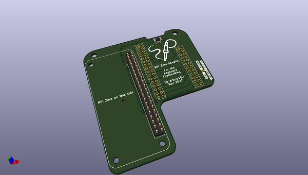
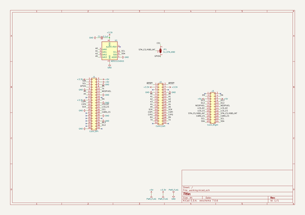

# OOMP Project  
## keyboard_featherwing_zero_adapter  by solderparty  
  
(snippet of original readme)  
  
- Raspberry Pi Zero Adapter for the Keyboard FeatherWing  
  
  
  
This adapter was designed specifically to allow driving the Keyboard FeatherWing with a Raspberry Pi Zero board.  
  
The SW support for the adapter is very limited right now, see https://github.com/solderparty/keyboard_featherwing_sw/wiki/RPi-Zero-Adapter to learn more about the progress.  
  full source readme at [readme_src.md](readme_src.md)  
  
source repo at: [https://github.com/solderparty/keyboard_featherwing_zero_adapter](https://github.com/solderparty/keyboard_featherwing_zero_adapter)  
## Board  
  
  
## Schematic  
  
  
  
[schematic pdf](working_schematic.pdf)  
## Images  
