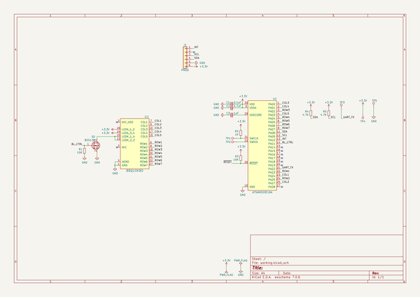

# OOMP Project  
## pmod_bbq10_keyboard  by solderparty  
  
oomp key: oomp_projects_flat_solderparty_pmod_bbq10_keyboard  
(snippet of original readme)  
  
- BB Q10 Keyboard PMOD  
  
  
  
  
  
  
  
A BB Q10 Keyboard in PMOD format!  
  
This board uses a ATSAMD20 chip as a i2c slave that can be polled to get the key FIFO, the firmware for the SAM can be found here: https://github.com/arturo182/bbq10kbd_i2c_sw  
  
The SAM chip also controls the backlight of the keyboard, the backlight brightness can be controlled over I2C as well.  
  
A kernel module for the Raspberry Pi is available here: https://github.com/arturo182/bbq10pmod_module  
  
  full source readme at [readme_src.md](readme_src.md)  
  
source repo at: [https://github.com/solderparty/pmod_bbq10_keyboard](https://github.com/solderparty/pmod_bbq10_keyboard)  
## Board  
  
  
## Schematic  
  
  
  
[schematic pdf](working_schematic.pdf)  
## Images  
