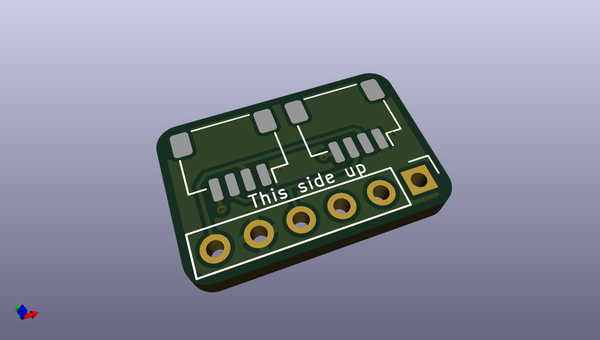
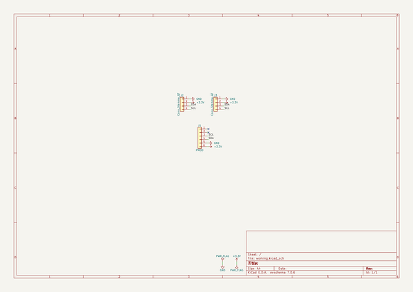

# OOMP Project  
## pmod_to_qwiic_adapter  by solderparty  
  
(snippet of original readme)  
  
- PMOD to Qwiic/Stemma QT Adapter with Daisy Chaining  
  
This little board makes it easy to use I2C PMOD boards with the Qwiic and Stemma QT ecosystems of boards.  
  
  full source readme at [readme_src.md](readme_src.md)  
  
source repo at: [https://github.com/solderparty/pmod_to_qwiic_adapter](https://github.com/solderparty/pmod_to_qwiic_adapter)  
## Board  
  
  
## Schematic  
  
  
  
[schematic pdf](working_schematic.pdf)  
## Images  
