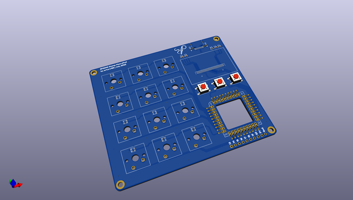

# OOMP Project  
## rp2040_stamp_macropad_hw  by solderparty  
  
oomp key: oomp_projects_flat_solderparty_rp2040_stamp_macropad_hw  
(snippet of original readme)  
  
- RP2040 Stamp MacroPad (Flux Project)  
  
  
  
Just add switches and key caps and you have a 3x4 MacroPad powered by the RP2040 Stamp, each key footprint includes a individually addressable **NeoPixel**, the board also comes with a **1.3" 128x64 OLED**, **three function buttons**, and extra GPIOs on an **optional header**.   
  
The board features a 3-in-1 combo RP2040 Stamp footprint, meaning you can solder the Stamp directly using the SMD pads, use 2mm pin headers, or using our FlexyPins!  
  
You can program it using Arduino or CircuitPython.  
  
- What does "Flux Project" mean?  
  
At Solder Party, we always want to get interesting products in people's hands. However, releasing a product is no easy feat, we need to make sure everything is polished, provide documentation, examples, and extensive support.  
  
With Flux, we want to streamline the process a bit, get fun projects into everyone's hands quicker.  
  
Flux projects are more experimental in nature. While they are tested and verified, the documentation might not be fully there, and the examples might be very basic.   
Flux projects are targeted at people who are not scared to put a bit of extra work into getting the project to where they want it to end up.  
These projects are also produced in smaller quantities, there is no guarantee there will be more produced in the future. Even if there is a new batch, it might differ from the initial version.   
  
These projects are in constant Flux, so to speak.  
  
If there is enough int  
  full source readme at [readme_src.md](readme_src.md)  
  
source repo at: [https://github.com/solderparty/rp2040_stamp_macropad_hw](https://github.com/solderparty/rp2040_stamp_macropad_hw)  
## Board  
  
  
## Schematic  
  
  
  
[schematic pdf](working_schematic.pdf)  
## Images  
  
  
  
  
  
  
  
  
  
  
  
  
  
  
  
  
