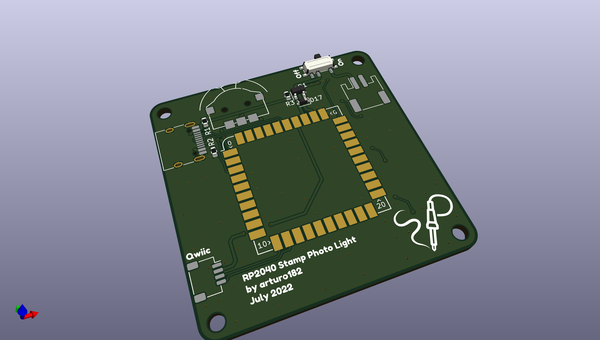

# OOMP Project  
## rp2040_stamp_photolight_hw  by solderparty  
  
(snippet of original readme)  
  
- RP2040 Stamp Photo Light (Flux Project)  
  
  
  
  
  
This Flux Project transforms the RP2040 Stamp into a minimalistic 4x4 NeoPixel matrix. The board contains a **three-way switch**, a **Qwiic** connector, a **LiPo** connector, USB Type-C socket, and a **power switch**.  
  
As the Photo Light is powered by the Stamp, you can run **CircuitPython** on it, as well as **Arduino**.  
  
- Details  
  
Make sure you use a 3.7V/4.2V LiPo with the Photo Light.  
  
The board contains four M2.5 mounting holes, which could be used to attach a diffuser or a case to hold the battery.  
  
- What does "Flux Project" mean?  
  
At Solder Party, we always want to get interesting products in people's hands. However, releasing a product is no easy feat, we need to make sure everything is polished, provide documentation, examples, and extensive support.  
  
With Flux, we want to streamline the process a bit, get fun projects into everyone's hands quicker.  
  
Flux projects are more experimental in nature. While they are tested and verified, the documentation might not be fully there, and the examples might be very basic.   
Flux projects are targeted at people who are not scared to put a bit of extra work into getting the project to where they want it to end up.  
These projects are also produced in smaller quantities, there is no guarantee there will be more produced in the future. Even if there is a new batch, it might differ from the initial version.   
  
These projects are in constant Flux, s  
  full source readme at [readme_src.md](readme_src.md)  
  
source repo at: [https://github.com/solderparty/rp2040_stamp_photolight_hw](https://github.com/solderparty/rp2040_stamp_photolight_hw)  
## Board  
  
  
## Schematic  
  
  
  
[schematic pdf](working_schematic.pdf)  
## Images  
