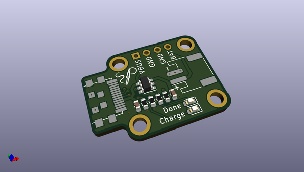
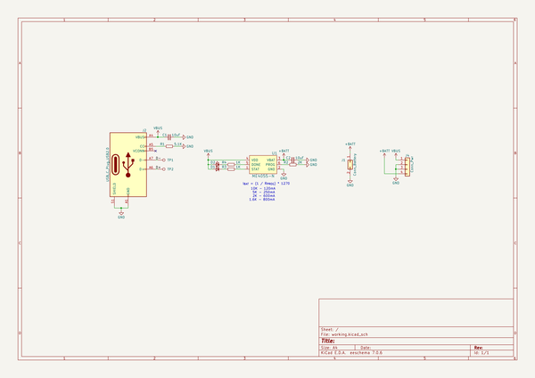
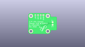
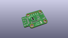
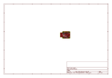
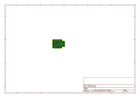
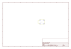
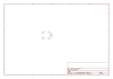
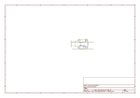

# OOMP Project  
## type-c_plug_lipo  by solderparty  
  
oomp key: oomp_projects_flat_solderparty_type_c_plug_lipo  
(snippet of original readme)  
  
- 3.7V/4.2V LiPo Battery Charger with USB Type-C Plug  
  
A simple breakout board for the ME4055-N LiPo charger.  
  full source readme at [readme_src.md](readme_src.md)  
  
source repo at: [https://github.com/solderparty/type-c_plug_lipo](https://github.com/solderparty/type-c_plug_lipo)  
## Board  
  
  
## Schematic  
  
  
  
[schematic pdf](working_schematic.pdf)  
## Images  
  
  
  
  
  
  
  
  
  
  
  
  
  
  
  
  
