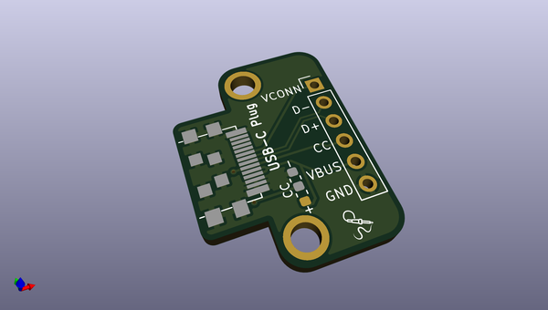
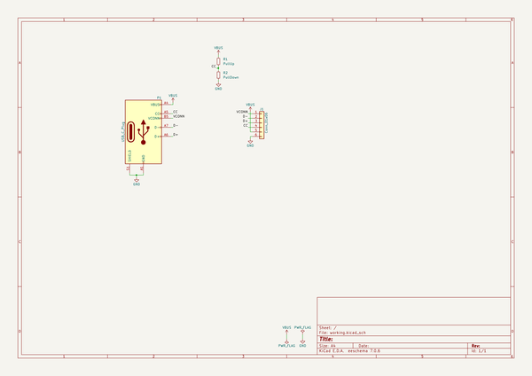

# OOMP Project  
## usb_c_plug_breakout  by solderparty  
  
(snippet of original readme)  
  
- USB Type-C Plug Breakout Boards  
  
Two breakout boards for a USB Type-C Plug connector. One with USB 2.0 pins only and one with USB 3.0.  
  
  full source readme at [readme_src.md](readme_src.md)  
  
source repo at: [https://github.com/solderparty/usb_c_plug_breakout](https://github.com/solderparty/usb_c_plug_breakout)  
## Board  
  
  
## Schematic  
  
  
  
[schematic pdf](working_schematic.pdf)  
## Images  
