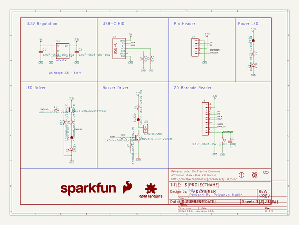

# OOMP Project  
## 2D_Barcode_Scanner_Breakout  by sparkfun  
  
(snippet of original readme)  
  
2D Barcode Scanner Breakout  
========================================  
  
  
  
[*2D Barcode Scanner Breakout (BOB-18088)*](https://www.sparkfun.com/products/18088)  
  
The DYScan DE2120 is one of the coolest little barcode scanners we've ever seen. This tiny "scan engine" will read 20 different barcode symbologies — both 1D and 2D! This is achieved by using a camera coupled with on-board image processing to identify and decode everything from UPC codes to QR codes. The module also features two LEDs: one for illumination and one to project the red line that you're used to seeing from laser-based scanners.   
  
This breakout board makes it easy to explore all of the capabilities of the DE2120 without dealing with finicky flat flex cables. The scanner's USB interface is exposed via the on-board USB-C connector. A buzzer and status LED are connected to the module through appropriate drive circuits and a pushbutton tactile switch is provided on the "trigger" pin. When you're ready to incorporate the module into your embedded project, you can leverage the 5 pin header for direct access to the TTL serial pins, power pins, and trigger input.  
  
The module can be configured either by using the serial interface or by scanning command barcodes found in the datasheet.  
  
Repository Contents  
-------------------  
* **/Documentation** - Datasheet & Settings Manual  
* **/Hardware** - Eagle de  
  full source readme at [readme_src.md](readme_src.md)  
  
source repo at: [https://github.com/sparkfun/2D_Barcode_Scanner_Breakout](https://github.com/sparkfun/2D_Barcode_Scanner_Breakout)  
## Board  
  
  
## Schematic  
  
  
  
[schematic pdf](working_schematic.pdf)  
## Images  
  
  
  
  
  
  
  
  
  
  
  
  
  
  
  
  
