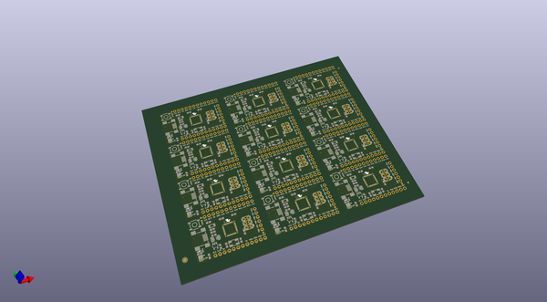
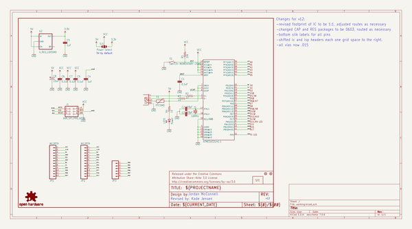
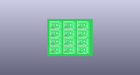
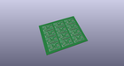
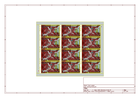
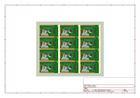
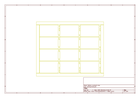
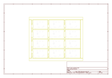
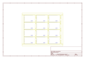
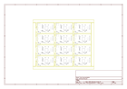

# OOMP Project  
## 32U4_Breakout_Board  by sparkfun  
  
(snippet of original readme)  
  
ATMEGA32U4 Breakout Board  
=========================  
  
[   
*ATMEGA32U4 Breakout Board (DEV-11117)*](https://www.sparkfun.com/products/11117)  
  
This breakout board is designed for folks who would like to program outside of the Arduino IDE. THe board  
comes preloaded with the LUFA CDC bootloader, allowing code to be built in WinAVR and program the board over USB  
using AVRDUDE.   
  
Repository Contents  
-------------------  
* **/Bootloaders** - CDC bootloader and instructions for installation  
* **/Examples** - Example code for the board  
* **/Hardware** - All Eagle design files (.brd, .sch)  
* **/LUFA** - Instructions for setting up the LUFA bootloader  
  
  
License Information  
-------------------  
The hardware is released under [Creative Commons Share-alike 3.0](http://creativecommons.org/licenses/by-sa/3.0/).    
All other code is open source so please feel free to do anything you want with it; you buy me a beer if you use this and we meet someday ([Beerware license](http://en.wikipedia.org/wiki/Beerware)).  
  
Notes for Installation  
----------------------  
This directory contains the bootloader and example source files for  
Sparkfun's 32u4 Breakout board. Both were built on WinXP sp3 with  
WinAVR-20100110 and AVRDUDE 5.10.  
  
The bootloader is a modified LUFA-130303 CDC bootloader.  
  
The bootloader directory contains the source and hex file for the bootloader  
that ships with this board.  When you fir  
  full source readme at [readme_src.md](readme_src.md)  
  
source repo at: [https://github.com/sparkfun/32U4_Breakout_Board](https://github.com/sparkfun/32U4_Breakout_Board)  
## Board  
  
  
## Schematic  
  
  
  
[schematic pdf](working_schematic.pdf)  
## Images  
  
  
  
  
  
  
  
  
  
  
  
  
  
  
  
  
