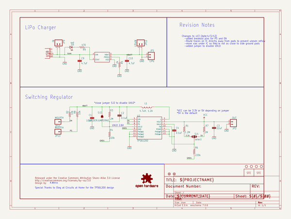
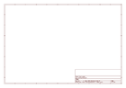
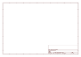

# OOMP Project  
## 3D_Models  by sparkfun  
  
(snippet of original readme)  
  
3D Models for SparkFun Products!  
----------------  
  
This is a repository of basic geometry and source CAD files for 3D models that appear on our website. Models are stored in real world (1x) scale. STL units are millimeters.  
  
_If you are using [eagleUp](https://eagleup.wordpress.com/) be sure to only export ```Place``` layers_  
  
-- Directory Structure  
  
Folders and file names must only use a-z, - and _  
  
---- Product Geometry Model Structure:  
```  
products/{product_id}/{rev_if_applicable}/{file_type}/  
  
Ex:  
products/12099/iges/12099.iges  
products/12099/step/12099.step  
products/12099/stl/12099.stl  
  
If there were any revisions for this product_id:  
products/11113/rev_1.0/stl/11113.stl  
products/11113/rev_1.1/stl/11113.stl  
```  
  
---- Source Model Structure:  
```  
products/{product_id}/{rev_if_applicable}/source_{software}/  
  
Ex:  
products/11763/source_solidworks/model.sldprt  
  
If there were any revisions for this product_id:  
products/11763/rev_1.0/source_solidworks/11763.sldprt  
products/11763/rev_1.1/source_solidworks/11763.sldprt  
  
```  
  
---- Product Display Structure:  
We can display any combination of stl or json with textures  
```  
products/{product_id}/display/modela.stl  
  
Ex:  
products/8601/display/8601a.stl  
products/8601/display/8601b.json  
products/8601/display/8601b_texture.png  
```  
  
  
-- Blender Common Display Materials  
  
_Use the io_three blender addon in the https://github.com/mrdoob/three.js repository to export textured display models for our site_  
  
_Be sure to set your scene's display dev  
  full source readme at [readme_src.md](readme_src.md)  
  
source repo at: [https://github.com/sparkfun/3D_Models](https://github.com/sparkfun/3D_Models)  
## Board  
  
[](working_3d.png)  
## Schematic  
  
[](working_schematic.png)  
  
[schematic pdf](working_schematic.pdf)  
## Images  
  
[](working_3D_bottom.png)  
  
[](working_3D_top.png)  
  
[](working_assembly_page_01.png)  
  
[](working_assembly_page_02.png)  
  
[](working_assembly_page_03.png)  
  
[](working_assembly_page_04.png)  
  
[](working_assembly_page_05.png)  
  
[](working_assembly_page_06.png)  
