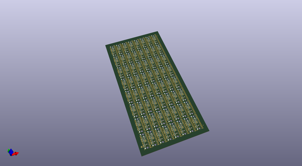
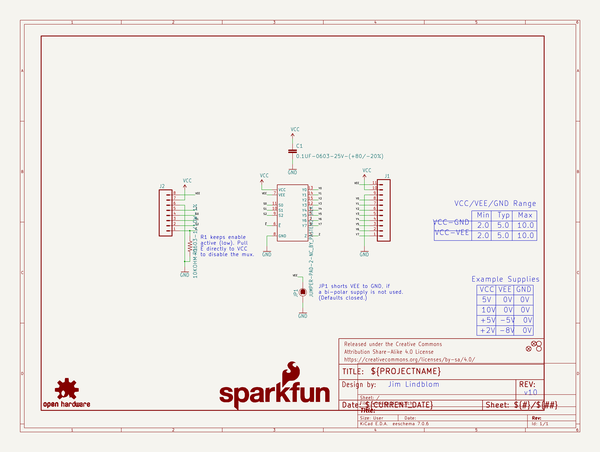
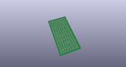
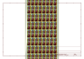
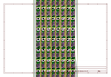
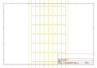
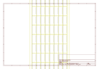
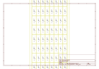

# OOMP Project  
## 74HC4051_8-Channel_Mux_Breakout  by sparkfun  
  
(snippet of original readme)  
  
SparkFun Multiplexer Breakout - 8 Channel (74HC4051)  
========================================  
  
  
  
[*SparkFun Multiplexer Breakout - 8 Channel (74HC4051) (SKU)*](https://www.sparkfun.com/products/13906)  
  
The SparkFun Multiplexer Breakout provides access to all pins and features of the 74HC4051, an 8-channel analog multiplexer/demultiplexer. The 74HC4051 allows you to turn four I/O pins into eight multi-functional, individually-selectable signals, which can be used do everything from driving eight LEDs to monitoring eight potentiometers.  
  
Repository Contents  
-------------------  
  
* **/Firmware** - Example code   
* **/Hardware** - Eagle design files (.brd, .sch)  
* **/Production** - Production panel files (.brd)  
  
Documentation  
--------------  
* **[Hookup Guide](https://learn.sparkfun.com/tutorials/multiplexer-breakout-hookup-guide)** - Basic hookup guide for the Multiplexer Breakout - 8 Channel (74HC4051).  
* **[SparkFun Fritzing repo](https://github.com/sparkfun/Fritzing_Parts)** - Fritzing diagrams for SparkFun products.  
* **[SparkFun 3D Model repo](https://github.com/sparkfun/3D_Models)** - 3D models of SparkFun products.   
  
Product Versions  
----------------  
* [BOB-13906](https://www.sparkfun.com/products/13906)- Basic part and short description here  
  
Version History  
---------------  
* [v1.0](https://github.com/sparkfun/74HC4  
  full source readme at [readme_src.md](readme_src.md)  
  
source repo at: [https://github.com/sparkfun/74HC4051_8-Channel_Mux_Breakout](https://github.com/sparkfun/74HC4051_8-Channel_Mux_Breakout)  
## Board  
  
  
## Schematic  
  
  
  
[schematic pdf](working_schematic.pdf)  
## Images  
  
  
  
  
  
  
  
  
  
  
  
  
  
  
  
  
