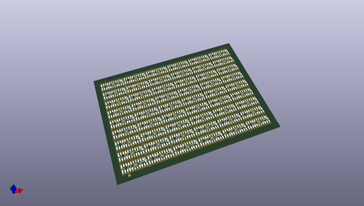
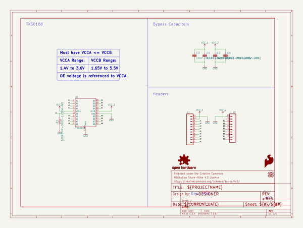

# OOMP Project  
## 8_channel_level_shifter_TXS0108E  by sparkfun  
  
oomp key: oomp_projects_flat_sparkfun_8_channel_level_shifter_txs0108e  
(snippet of original readme)  
  
SparkFun Level Shifter - 8 Channel (TXS01018E)   
===========================================  
  
  
  
[*SparkFun Level Shifter - 8 Channel (TXS01018E) (BOB-19626)*](https://www.sparkfun.com/products/19626)  
  
The SparkFun Level Shifter - 8 Channel (TXS01018E) features the TXS01018E&trade; 8-bit, bi-directional logic level translator from Texas Instruments to shift between devices running at different common microcontroller voltages such as 1.8V, 3.3V and 5V. The TXS0108E can transmit data between ports at max speeds of 110Mbps (push/pull) or 1.2Mbps (open drain).  
  
Repository Contents  
-------------------  
  
* **/Documents** - Datasheet  
* **/Hardware** - Eagle design files (.brd, .sch)  
  
Documentation  
-------------  
  
* **[Hookup Guide](https://learn.sparkfun.com/tutorials/8-channel-level-shifter-breakout---txs01018e-hookup-guide)** - A basic Hookup Guide to get started with the SparkFun Level Shifter - 8 Channel (TXS01018E).  
  
Product Versions  
----------------  
  
* **[BOB-19626](https://www.sparkfun.com/products/19626)** - Initial Release  
  
Version History  
---------------  
  
* v1.0 - Initial Release  
  
License Information  
-------------------  
  
This product is _**open source**_!   
  
Please review the LICENSE.md file for license information.   
  
If y  
  full source readme at [readme_src.md](readme_src.md)  
  
source repo at: [https://github.com/sparkfun/8_channel_level_shifter_TXS0108E](https://github.com/sparkfun/8_channel_level_shifter_TXS0108E)  
## Board  
  
  
## Schematic  
  
  
  
[schematic pdf](working_schematic.pdf)  
## Images  
