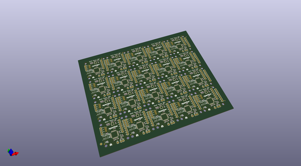
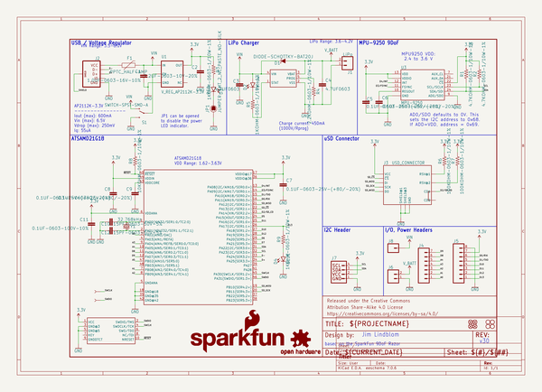

# OOMP Project  
## 9DOF_Razor_IMU  by sparkfun  
  
(snippet of original readme)  
  
SparkFun 9DoF Razor IMU M0  
========================================  
  
  
  
[*SparkFun 9DoF Razor IMU M0 (SEN-14001)*](https://www.sparkfun.com/products/14001)  
  
The [SparkFun 9DoF Razor IMU M0](https://www.sparkfun.com/products/14001) combines a [SAMD21](https://www.sparkfun.com/products/13664) microprocessor with an [MPU-9250](https://www.sparkfun.com/products/13762) 9DoF (nine degrees of freedom) sensor to create a tiny, re-programmable, multi-purpose inertial measurement unit (IMU). It can be programmed to monitor and log motion, transmit Euler angles over a serial port, or to even act as a step-counting pedometer.  
  
The 9DoF Razor's MPU-9250 features three, three-axis sensors -- an accelerometer, gyroscope, and magnetometer -- which gives it the ability to sense linear acceleration, angular rotation velocity, and magnetic field vector's. The on-board microprocessor -- Atmel's [SAMD21G18A](http://www.atmel.com/devices/ATSAMD21G18.aspx) -- is an Arduino-compatible, 32-bit ARM Cortex-M0+ microcontroller also featured on the [Arduino Zero](https://www.arduino.cc/en/Main/ArduinoBoardZero) and [SAMD21 Mini Breakout](https://www.sparkfun.com/products/13664) boards.  
  
Repository Contents  
-------------------  
  
* **/Documentation** - Data sheets, additional product information  
* **/Firmware** - Example code   
* **/Hardware** - Eagle design files (.b  
  full source readme at [readme_src.md](readme_src.md)  
  
source repo at: [https://github.com/sparkfun/9DOF_Razor_IMU](https://github.com/sparkfun/9DOF_Razor_IMU)  
## Board  
  
  
## Schematic  
  
  
  
[schematic pdf](working_schematic.pdf)  
## Images  
