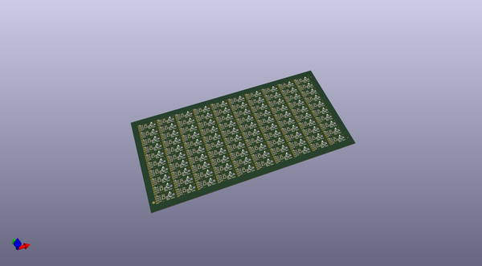
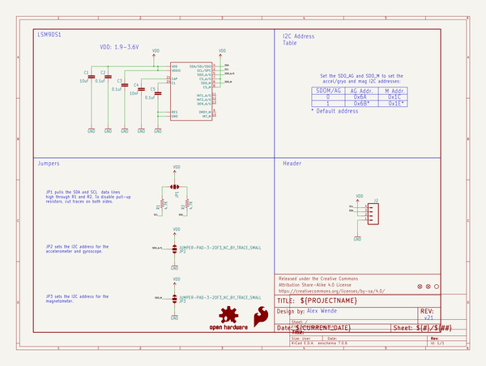
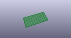
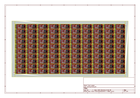
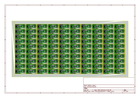
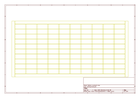
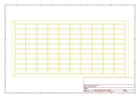
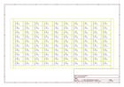

# OOMP Project  
## 9DOF_Sensor_Stick  by sparkfun  
  
oomp key: oomp_projects_flat_sparkfun_9dof_sensor_stick  
(snippet of original readme)  
  
SparkFun 9 Degrees of Freedom - Sensor Stick  
=============================================  
  
  
  
[*SparkFun 9 Degrees of Freedom - Sensor Stick (SEN-13944)*](https://www.sparkfun.com/products/13944)  
  
  
The SparkFun 9DOF Sensor Stick is a very small sensor board with 9 degrees of freedom.  
It includes the LSM9DS1 with a simple I2C interface and a mounting hole for attaching it to your project.  
Also, the board is a mere 0.9" in length, 0.4" in width, and 0.036" thick (0.093" overall), allowing it to be easily mounted in just about any application.  
   
 Repository Contents  
-------------------  
* **/Hardware** - All Eagle design files (.brd, .sch)  
  
Documentation  
--------------  
  
* **[Installing an Arduino Library Guide](https://learn.sparkfun.com/tutorials/installing-an-arduino-library)** - Basic information on how to install an Arduino library.  
* **[Library](https://github.com/sparkfun/SparkFun_LSM9DS1_Arduino_Library)** - Arduino library for the 9DoF Sensor Stick.  
* **[Hookup Guide](https://learn.sparkfun.com/tutorials/9dof-sensor-stick-hookup-guide)** - Basic hookup guide for the 9DoF Sensor Stick.  
   
License Information  
-------------------  
The hardware is released under [Creative Commons ShareAlike 4.0 International](https://creativecommons.org/licenses/by-sa/4.0/).  
The code is beerware; if you see me (or any other SparkFun employee) at the local, and you've found our code helpf  
  full source readme at [readme_src.md](readme_src.md)  
  
source repo at: [https://github.com/sparkfun/9DOF_Sensor_Stick](https://github.com/sparkfun/9DOF_Sensor_Stick)  
## Board  
  
  
## Schematic  
  
  
  
[schematic pdf](working_schematic.pdf)  
## Images  
  
  
  
  
  
  
  
  
  
  
  
  
  
  
  
  
