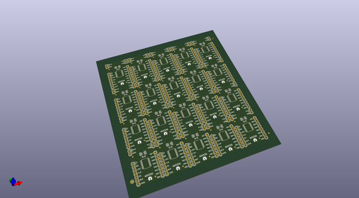
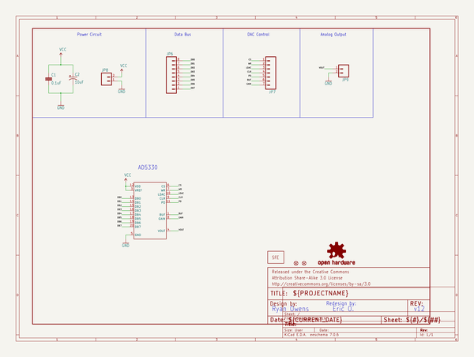

# OOMP Project  
## AD5330_Breakout  by sparkfun  
  
oomp key: oomp_projects_flat_sparkfun_ad5330_breakout  
(snippet of original readme)  
  
SparkFun AD5330 Breakout  
========================  
  
  
  
[*SparkFun Breakout Board for AD5330 Parallel 8-Bit DAC (BOB-12082)*](https://www.sparkfun.com/products/12082)  
  
This is a breakout board for Analog Device's AD5330 8-bit digital-to-analog converter.   
It runs from 2.5 to 5.5V.   
  
Repository Contents  
-------------------  
  
* **/Hardware** - All Eagle design files (.brd, .sch)  
* **/Libraries** - All Arduino libraries and board examples  
* **/Production** - Test bed files and production panel files  
  
Documentation  
--------------  
  
* **[Installing an Arduino Library Guide](https://learn.sparkfun.com/tutorials/installing-an-arduino-library)** - Basic information on how to install an Arduino library.  
* **[Product Repository](https://github.com/sparkfun/AD5330_Breakout)** - Main repository (including hardware files) for the AD5330 Breakout.  
* **[Tutorial](http://www.sparkfun.com/commerce/tutorial_info.php?tutorials_id=160)** - Basic tutorial for the AD5330 Breakout.  
  
Product Versions  
----------------  
* [BOB-12082](https://www.sparkfun.com/products/12082)  
  
Version History  
---------------  
* [V_H1.2_L1.2.3](https://github.com/sparkfun/AD5330_Breakout/tree/V_H1.2_L1.2.3) - Updating library, readme info, license  
* [V_1.2.2](https://github.com/sparkfun/AD5330_Breakout/tree/V_1.2.2) - Fixed link  
* [V_1.2.1](https://github.com/sparkfun/AD5330_Breakout/tree/V_1.2.1) - Pulled latest libs  
* [V1.2](ht  
  full source readme at [readme_src.md](readme_src.md)  
  
source repo at: [https://github.com/sparkfun/AD5330_Breakout](https://github.com/sparkfun/AD5330_Breakout)  
## Board  
  
  
## Schematic  
  
  
  
[schematic pdf](working_schematic.pdf)  
## Images  
