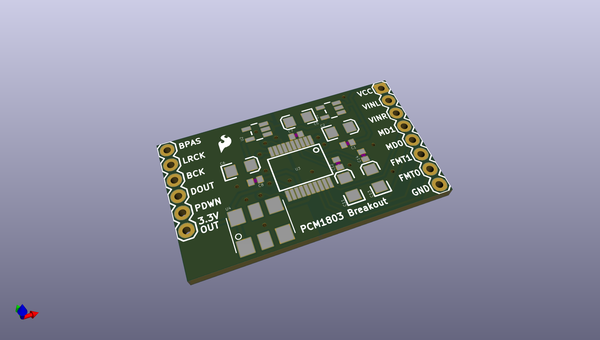
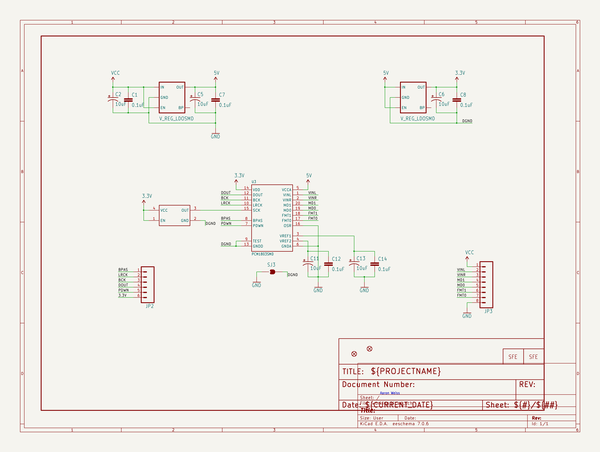
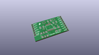
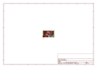
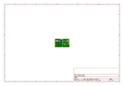
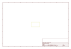
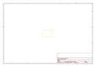
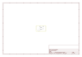

# OOMP Project  
## AD_Stereo_Converter-PCM1803A  by sparkfun  
  
oomp key: oomp_projects_flat_sparkfun_ad_stereo_converter_pcm1803a  
(snippet of original readme)  
  
SparkFun Analog to Digital Stereo Converter Breakout - PCM1803A  
===============================================================  
  
  
  
[*SparkFun Analog to Digital Stereo Converter Breakout - PCM1803A (BOB-09365)*](https://www.sparkfun.com/products/9365)  
  
The PCM1803A is a high-performance, low-cost, 24-bit stereo analog-to-digital converter that can sample as high as 96k.   
The PCM1803A is a great choice for a wide variety of applications where high performance is necessary.   
  
Repository Contents  
-------------------  
* **/Firmware** - Example code   
* **/Hardware** - All Eagle design files (.brd, .sch)  
  
License Information  
-------------------  
The hardware is released under [Creative Commons ShareAlike 4.0 International](https://creativecommons.org/licenses/by-sa/4.0/).  
The code is beerware; if you see me (or any other SparkFun employee) at the local, and you've found our code helpful, please buy us a round!  
  
Distributed as-is; no warranty is given.  
  
  full source readme at [readme_src.md](readme_src.md)  
  
source repo at: [https://github.com/sparkfun/AD_Stereo_Converter-PCM1803A](https://github.com/sparkfun/AD_Stereo_Converter-PCM1803A)  
## Board  
  
  
## Schematic  
  
  
  
[schematic pdf](working_schematic.pdf)  
## Images  
  
  
  
  
  
  
  
  
  
  
  
  
  
  
  
  
