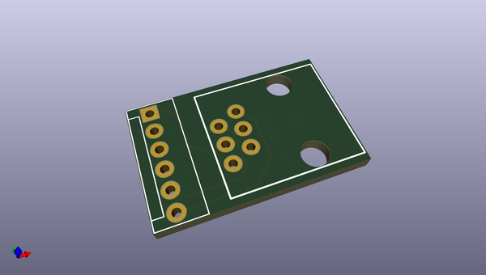
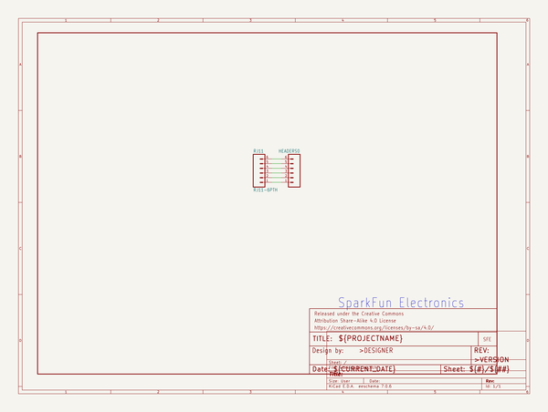

# OOMP Project  
## Adapter_Board-ICD_ICD2  by sparkfun  
  
oomp key: oomp_projects_flat_sparkfun_adapter_board_icd_icd2  
(snippet of original readme)  
  
SparkFun Adapter Board-ICD/ICD2  
===============================  
  
  
  
[*SparkFun Adapter Board- ICD/ICD2 (BOB-00193)*](https://www.sparkfun.com/products/193)  
  
This is a small PCB that adapts the standard Microchip   
6-Pin RJ11 connector to the Olimex 6-Pin .1" Molex Connector.  
  
  
Repository Contents  
-------------------  
* **/Hardware** - All Eagle design files (.brd, .sch, .STL)  
  
License Information  
-------------------  
The hardware is released under [Creative Commons ShareAlike 4.0 International](https://creativecommons.org/licenses/by-sa/4.0/).  
  
Distributed as-is; no warranty is given.  
  
  full source readme at [readme_src.md](readme_src.md)  
  
source repo at: [https://github.com/sparkfun/Adapter_Board-ICD_ICD2](https://github.com/sparkfun/Adapter_Board-ICD_ICD2)  
## Board  
  
  
## Schematic  
  
  
  
[schematic pdf](working_schematic.pdf)  
## Images  
