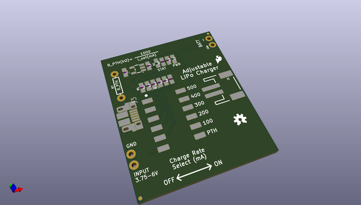
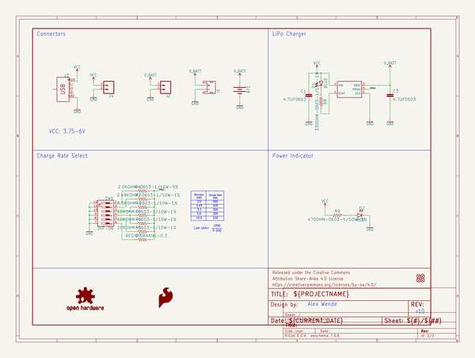
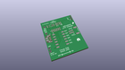
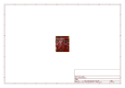
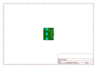
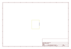
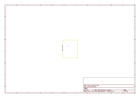
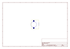
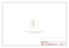

# OOMP Project  
## Adjustable_Lipo_Charger  by sparkfun  
  
(snippet of original readme)  
  
SparkFun Adjustable LiPo Charger  
============================================  
  
  
  
[*Adjustable LiPo Charger (PRT-14380)*](https://www.sparkfun.com/products/14380)  
  
The Adjustable LiPo Charger will charge any single cell Lithium Ion (Li-Ion) or Lithium Polymer (LiPo) battery with a maximum current of 500mA. Simply plug in a micro B USB cable or any power supply between 3.75-6VDC to one end, and your rechargeable lithium battery to the other end. Once the current has been set on the DIP switches you're ready to go to charge your battery in 100mA increments up to 500mA, or as low as 15mA using the custom charge rate by soldering in the appropriate resistor to R_PTH.  
  
Repository Contents  
-------------------  
  
* **/Hardware** - All Eagle design files (.brd and .sch)  
* **/Production** - Production panel files  
  
Documentation  
-------------------  
  
* [Adjustable LiPo Charger Hookup Guide ](https://learn.sparkfun.com/tutorials/adjustable-lipo-charger-hookup-guide)  
  
License Information  
-------------------  
This product is _**open source**_!   
  
Please review the LICENSE.md file for license information.   
  
If you have any questions or concerns on licensing, please contact techsupport@sparkfun.com.  
  
Distributed as-is; no warranty is given.  
  
- Your friends at SparkFun.  
  
All other code is open source so please feel free to do anything you want with it; you buy me a beer if you use this and we meet someday ([Bee  
  full source readme at [readme_src.md](readme_src.md)  
  
source repo at: [https://github.com/sparkfun/Adjustable_Lipo_Charger](https://github.com/sparkfun/Adjustable_Lipo_Charger)  
## Board  
  
  
## Schematic  
  
  
  
[schematic pdf](working_schematic.pdf)  
## Images  
  
  
  
  
  
  
  
  
  
  
  
  
  
  
  
  
