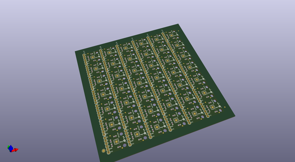
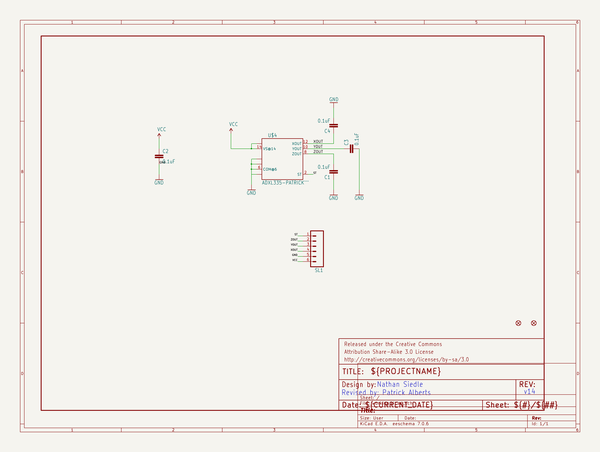

# OOMP Project  
## ADXL335_Breakout  by sparkfun  
  
oomp key: oomp_projects_flat_sparkfun_adxl335_breakout  
(snippet of original readme)  
  
SparkFun Triple Axis Accelerometer Breakout - ADXL335  
======================  
  
  
  
[*Triple Axis Accelerometer Breakout-ADXL335 (SEN-09269)*](https://www.sparkfun.com/products/9269)  
  
This is a breakout board for teh 3-axis ADXL335 from Analog Devices. The sensor has a full sensing range of +- 3g and has an  
analog output.   
  
Repository Contents  
-------------------  
* **/Hardware** - All Eagle design files (.brd, .sch)  
* **/Production** - Test bed files and production panel files  
  
Documentation  
--------------  
* **[Accelerometer Basics](https://learn.sparkfun.com/tutorials/accelerometer-basics)**  
  
License Information  
-------------------  
The hardware is released under [Creative Commons ShareAlike 4.0 International](https://creativecommons.org/licenses/by-sa/4.0/).  
  
Distributed as-is; no warranty is given.  
  
  full source readme at [readme_src.md](readme_src.md)  
  
source repo at: [https://github.com/sparkfun/ADXL335_Breakout](https://github.com/sparkfun/ADXL335_Breakout)  
## Board  
  
  
## Schematic  
  
  
  
[schematic pdf](working_schematic.pdf)  
## Images  
