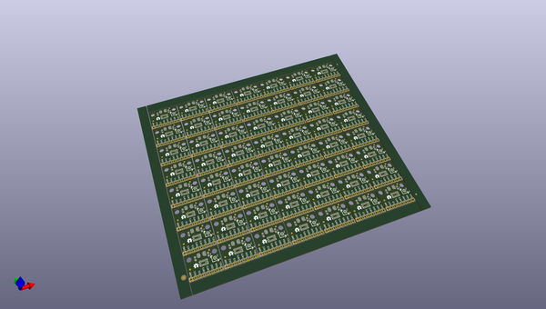
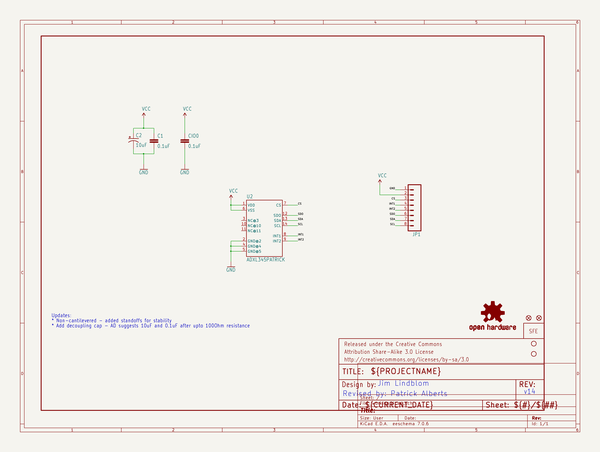
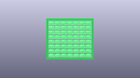
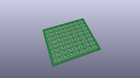
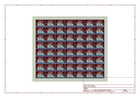
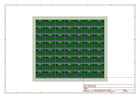
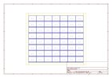
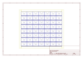

# OOMP Project  
## ADXL345_Breakout  by sparkfun  
  
(snippet of original readme)  
  
ADXL345 Breakout Board  
===============================  
  
[  
*ADXL345 Breakout Board (SEN-09836)*](https://www.sparkfun.com/products/9836)  
  
The ADXL345 is a small, thin, low power, 3-axis MEMS accelerometer with high resolution 913-bit) measurement at up to +-16g.   
Digital output data is formatted as 16-bit twos complement and is accessible through either an SPI or I2C digital interface.   
  
  
Repository Contents  
-------------------  
  
* **/Hardware** - All Eagle design files (.brd, .sch, .STL)  
* **/Libraries** - All Arduino libraries and board examples  
* **/Production** - Test bed files and production panel files  
  
  
License Information  
-------------------  
The hardware is released under [Creative Commons ShareAlike 4.0 International](https://creativecommons.org/licenses/by-sa/4.0/).  
The code is beerware; if you see me (or any other SparkFun employee) at the local, and you've found our code helpful, please buy us a round!  
  
Distributed as-is; no warranty is given.  
  
  full source readme at [readme_src.md](readme_src.md)  
  
source repo at: [https://github.com/sparkfun/ADXL345_Breakout](https://github.com/sparkfun/ADXL345_Breakout)  
## Board  
  
  
## Schematic  
  
  
  
[schematic pdf](working_schematic.pdf)  
## Images  
  
  
  
  
  
  
  
  
  
  
  
  
  
  
  
  
