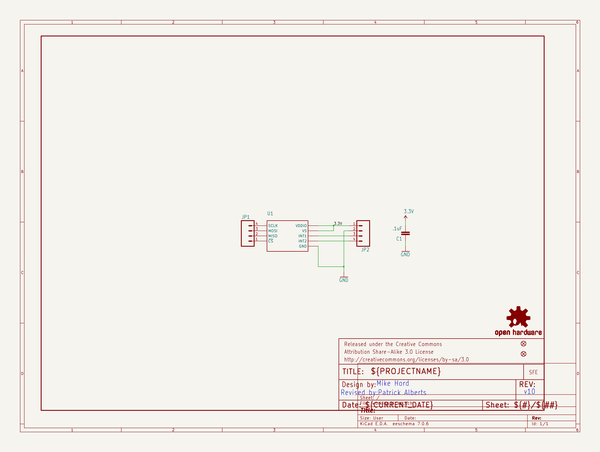
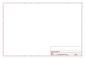
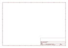

# OOMP Project  
## ADXL362_Breakout  by sparkfun  
  
(snippet of original readme)  
  
ADXL362 Breakout Board  
======================  
  
[  
*ADXL362 Breakout (SEN-11446)*](https://www.sparkfun.com/products/11446)  
  
The ADXL362 is a complete 3-axis MEMS acceleration measurement system that operates at extremely low power consumption levels.  
It communicates over SPI, and can autonomously operate for "wake-on-shake" operation.  
  
Repository Contents  
-------------------  
* **/Hardware** - All Eagle design files (.brd, .sch, .STL)  
* **/Production** - Test bed files and production panel files  
  
Available Libraries  
-----------------------------  
* [Winkel ICT ADXL362](https://github.com/winkelict/ADXL362)  
* [Annem ADXL362](https://github.com/annem/ADXL362)  
  
License Information  
-------------------  
The hardware is released under [Creative Commons ShareAlike 4.0 International](https://creativecommons.org/licenses/by-sa/4.0/).  
  
Distributed as-is; no warranty is given.  
  
  full source readme at [readme_src.md](readme_src.md)  
  
source repo at: [https://github.com/sparkfun/ADXL362_Breakout](https://github.com/sparkfun/ADXL362_Breakout)  
## Board  
  
  
## Schematic  
  
  
  
[schematic pdf](working_schematic.pdf)  
## Images  
  
  
  
  
  
  
  
  
  
  
  
  
  
  
  
  
