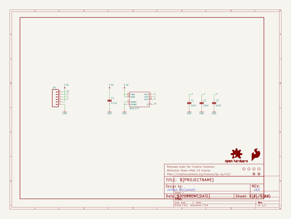
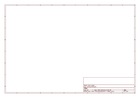
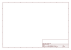

# OOMP Project  
## ADXL377_Breakout  by sparkfun  
  
oomp key: oomp_projects_flat_sparkfun_adxl377_breakout  
(snippet of original readme)  
  
ADXL377 Breakout  
================  
  
[     
*Triple Axis Accelerometer Breakout-ADXL377 (SEN-12803)*](https://www.sparkfun.com/products/12803)  
  
A Breakout Board for the ADXL377 Low Power 3-Axis ±200g Accelerometer with Analog Output.  
  
Repository Contents  
-------------------  
* **/Hardware** - All Eagle design files (.brd, .sch)  
* **/Production** - Test bed files and production panel files  
* **/Firmware** - All Arduino sketches for this product  
  
  
License Information  
-------------------  
The hardware is released under [Creative Commons ShareAlike 4.0 International](https://creativecommons.org/licenses/by-sa/4.0/).  
  
Distributed as-is; no warranty is given.  
  
  full source readme at [readme_src.md](readme_src.md)  
  
source repo at: [https://github.com/sparkfun/ADXL377_Breakout](https://github.com/sparkfun/ADXL377_Breakout)  
## Board  
  
  
## Schematic  
  
  
  
[schematic pdf](working_schematic.pdf)  
## Images  
  
  
  
  
  
  
  
  
  
  
  
  
  
  
  
  
