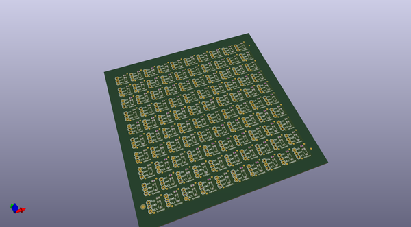
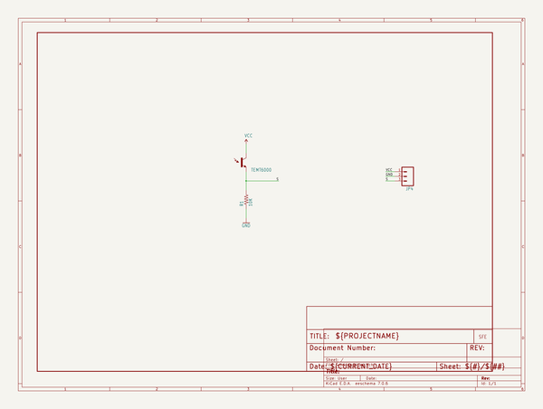
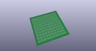
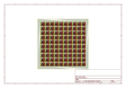
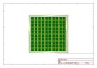
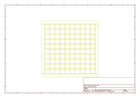
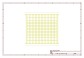
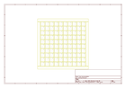

# OOMP Project  
## Ambient_Light_Sensor_Breakout-TEMT6000  by sparkfun  
  
(snippet of original readme)  
  
SparkFun Ambient Light Sensor Breakout Board - TEMT6000  
=========================================================  
  
  
[*SparkFun Ambient Light Sensor Breakout Board - TEMT6000 (BOB-08688)*](https://www.sparkfun.com/products/8688)  
  
 Basic breakout board for the TEMT6000 Ambient Light Sensor.  
   
   
Repository Contents  
-------------------  
  
* **/Hardware** - All Eagle design files (.brd, .sch)  
  
Documentation  
--------------  
  
* **[Hookup Guide](https://learn.sparkfun.com/tutorials/temt6000-ambient-light-sensor-hookup-guide)** - Basic hookup guide.  
  
License Information  
-------------------  
The hardware is released under [Creative Commons ShareAlike 4.0 International](https://creativecommons.org/licenses/by-sa/4.0/).  
  
Distributed as-is; no warranty is given.  
  
  full source readme at [readme_src.md](readme_src.md)  
  
source repo at: [https://github.com/sparkfun/Ambient_Light_Sensor_Breakout-TEMT6000](https://github.com/sparkfun/Ambient_Light_Sensor_Breakout-TEMT6000)  
## Board  
  
  
## Schematic  
  
  
  
[schematic pdf](working_schematic.pdf)  
## Images  
  
  
  
  
  
  
  
  
  
  
  
  
  
  
  
  
