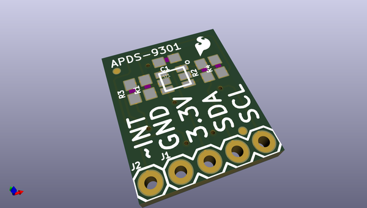
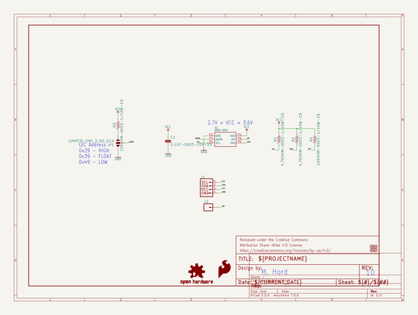
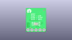
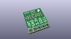
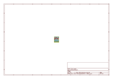
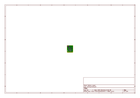
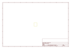
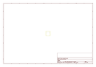
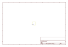
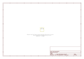

# OOMP Project  
## APDS-9301_Breakout  by sparkfun  
  
oomp key: oomp_projects_flat_sparkfun_apds_9301_breakout  
(snippet of original readme)  
  
SparkFun APDS-9301 Lux Sensor Breakout  
======================================  
  
    
  
[*APDS-9301 Lux Sensor Breakout (SEN-14350)*](https://www.sparkfun.com/products/14350)  
  
The APDS-9301 Lux Sensor Breakout is a small I2C based sensor with dynamic range.   
  
Repository Contents  
-------------------  
* **/Hardware** - All Eagle design files (.brd, .sch)  
* **/Libraries** - All Arduino libraries and board examples  
* **/Production** - Test bed files and production panel files  
  
  
Documentation  
--------------  
* **[Library](https://github.com/sparkfun/SparkFun_APDS9301_Library)** - Arduino library for the APDs-9301.  
* **[Hookup Guide](https://learn.sparkfun.com/tutorials/apds-9301-sensor-hookup-guide)** - Basic hookup guide for the APDS-9301 Breakout Board.  
  
License Information  
-------------------  
  
This product is _**open source**_!   
  
Please review the LICENSE.md file for license information.   
  
If you have any questions or concerns on licensing, please contact techsupport@sparkfun.com.  
  
Distributed as-is; no warranty is given.  
  
- Your friends at SparkFun.  
  
  full source readme at [readme_src.md](readme_src.md)  
  
source repo at: [https://github.com/sparkfun/APDS-9301_Breakout](https://github.com/sparkfun/APDS-9301_Breakout)  
## Board  
  
  
## Schematic  
  
  
  
[schematic pdf](working_schematic.pdf)  
## Images  
  
  
  
  
  
  
  
  
  
  
  
  
  
  
  
  
