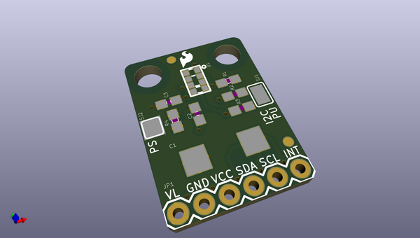

# OOMP Project  
## APDS-9960_RGB_and_Gesture_Sensor  by sparkfun  
  
(snippet of original readme)  
  
SparkFun APDS-9960 RGB and Gesture Sensor  
========================================  
  
  
  
[*SparkFun APDS-9960 Breakout Board (SEN-12787)*](https://www.sparkfun.com/products/12787)  
  
This is the SparkFun RGB and Gesture Sensor, a small breakout board with a built in APDS-9960 sensor that offers ambient light and color measuring, proximity detection, and touchless gesture sensing.  
With this RGB and Gesture Sensor you will be able to control a computer, microcontroller, robot, and more with a simple swipe of your hand!   
  
 Repository Contents  
-------------------  
  
* **/Hardware** - Eagle design files (.brd, .sch)  
* **/Libraries** - Libraries for use with the SparkFun APDS9960 RGB and Gesture Sensor  
* **/Production** - Production panel files (.brd)  
  
Documentation  
--------------  
* **[Quickstart Guide](https://learn.sparkfun.com/tutorials/apds-9960-rgb-and-gesture-sensor-hookup-guide)** - Basic hookup guide for the sensor.  
* **[Library/README](https://github.com/sparkfun/SparkFun_APDS-9960_Sensor_Arduino_Library/tree/V_1.4.1)** - Arduino library for the SparkFun_APDS9960 RGB and Gesture Sensor.  
* **[SparkFun Fritzing repo](https://github.com/sparkfun/Fritzing_Parts)** - Fritzing diagrams for SparkFun products.  
* **[SparkFun 3D Model repo](https://github.com/sparkfun/3D_Models)** - 3D models of SparkFun products.   
  
Product V  
  full source readme at [readme_src.md](readme_src.md)  
  
source repo at: [https://github.com/sparkfun/APDS-9960_RGB_and_Gesture_Sensor](https://github.com/sparkfun/APDS-9960_RGB_and_Gesture_Sensor)  
## Board  
  
  
## Schematic  
  
  
  
[schematic pdf](working_schematic.pdf)  
## Images  
