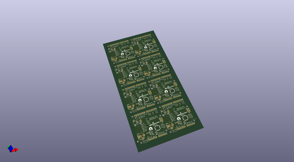
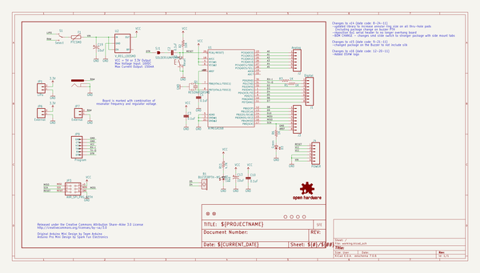
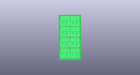
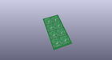
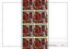
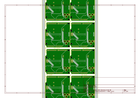
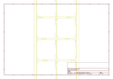
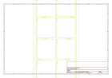
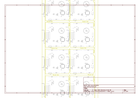

# OOMP Project  
## Arduino_Pro_328  by sparkfun  
  
(snippet of original readme)  
  
Arduino Pro 328  
========================================  
  
  
  
[*Arduino Pro 328 (DEV-10914)*](https://www.sparkfun.com/products/10914)  
  
Arduino Pro does not come with connectors populated so that you can solder in any connector or wire with any orientation you need.   
We recommend first time Arduino users start with the Uno R3. It’s a great board that will get you up and running quickly.   
The Arduino Pro series is meant for users that understand the limitations of system voltage, lack of connectors, and USB off board.  
  
Repository Contents  
-------------------  
  
* **/Hardware** - Eagle design files (.brd, .sch)  
* **/Production** - Production panel files (.brd)  
  
Documentation  
--------------  
* **[SparkFun Fritzing repo](https://github.com/sparkfun/Fritzing_Parts)** - Fritzing diagrams for SparkFun products.  
* **[SparkFun 3D Model repo](https://github.com/sparkfun/3D_Models)** - 3D models of SparkFun products.   
  
Product Versions  
----------------  
* [3.3V/8MHz: DEV-10914](https://www.sparkfun.com/products/10914)- 3.3V/8MHz version of the Arduino Pro.   
* [5V/16MHz: DEV-10915] (https://www.sparkfun.com/products/10915)- 5V/16MHz version of the Arduino Pro.   
  
  
License Information  
-------------------  
  
This product is _**open source**_!   
  
Please review the LICENSE.md file for license information.   
  
If you have any questions or concerns on licensing, please contact techsupport@sparkfun.com.  
  
Distributed as-is; no w  
  full source readme at [readme_src.md](readme_src.md)  
  
source repo at: [https://github.com/sparkfun/Arduino_Pro_328](https://github.com/sparkfun/Arduino_Pro_328)  
## Board  
  
  
## Schematic  
  
  
  
[schematic pdf](working_schematic.pdf)  
## Images  
  
  
  
  
  
  
  
  
  
  
  
  
  
  
  
  
