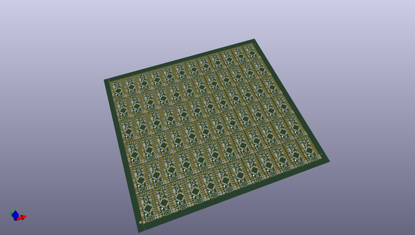
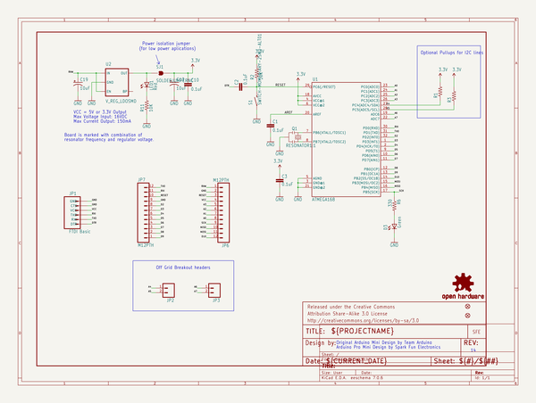
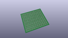
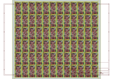
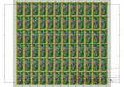
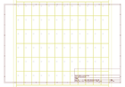
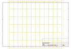
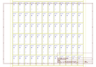
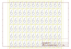

# OOMP Project  
## Arduino_Pro_Mini_328  by sparkfun  
  
oomp key: oomp_projects_flat_sparkfun_arduino_pro_mini_328  
(snippet of original readme)  
  
Arduino Pro Mini 328  
====================  
  
<table class="table table-hover table-striped table-bordered">  
  <tr align="center">  
   <td></td>  
   <td></td>  
  </tr>  
  <tr align="center">  
    <td><i>Arduino Pro Mini 328 - 5V/16MHz [<a href="https://www.sparkfun.com/products/11113">DEV-11113</a>]</i></td>  
    <td><i>Arduino Pro Mini 328 - 3.3V/8MHz [<a href="https://www.sparkfun.com/products/11114">DEV-11114</a>]</i></td>  
  </tr>  
</table>  
  
SparkFun's Arduino Pro Mini 328 is a bare bones super small Arduino compatible development board. This hardware is used for both the 3.3V/8MHz and the 5V/16MHz versions.   
  
Both of these products use the same PCB, but are populated with unique voltage regulators and resonators.  
  
Repository Contents  
-------------------  
* **/Documentation** - SVG and PDF datasheets for the Pro Mini  
* **/Hardware** - Eagle design files (Schematic and Board)  
* **/Production** - Test bed files and production panel files  
  
Documentation  
--------------  
* **[Hookup Guide](https://learn.sparkfun.com/tutorials/using-the-arduino-pro-mini-33v)** - Basic hookup guide for the Arduino Pro Mini 3.3V/8MHz. It can be used as a guide with the 5V. The only di  
  full source readme at [readme_src.md](readme_src.md)  
  
source repo at: [https://github.com/sparkfun/Arduino_Pro_Mini_328](https://github.com/sparkfun/Arduino_Pro_Mini_328)  
## Board  
  
  
## Schematic  
  
  
  
[schematic pdf](working_schematic.pdf)  
## Images  
  
  
  
  
  
  
  
  
  
  
  
  
  
  
  
  
