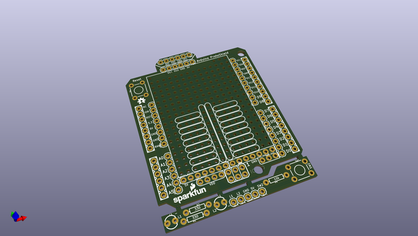
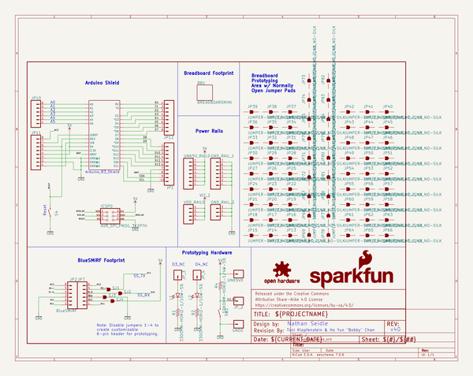

# OOMP Project  
## Arduino_ProtoShield_Bare_PCB  by sparkfun  
  
oomp key: oomp_projects_flat_sparkfun_arduino_protoshield_bare_pcb  
(snippet of original readme)  
  
SparkFun Arduino ProtoShield - Bare PCB  
=======================================  
  
<table class="table table-hover table-striped table-bordered">  
  <tr align="center">  
   <td></td>  
   <td></td>  
  </tr>  
  <tr align="center">  
    <td>SparkFun Arduino ProtoShield - Bare PCB [ <a href="https://www.sparkfun.com/products/13819">DEV-13819</a> ]</td>  
    <td>SparkFun ProtoShield Kit [ <a href="https://www.sparkfun.com/products/13820">DEV-13820</a> ]</td>  
  </tr>  
</table>  
  
The SparkFun Arduino ProtoShield is a bare PCB with no attached or included parts that lets you customize your own Arduino shield using whatever circuit you can come up with! You will even be able to test your circuit or project to make sure everything is working the way it should! The SparkFun Arduino ProtoShield is based off the Arduino R3’s footprint that allows you to easily incorporate it with favorite Arduino-based device.  
  
Repository Contents  
-------------------  
* **/Firmware** - Example code used in the hookup guide.  
* **/Hardware** - All Eagle de  
  full source readme at [readme_src.md](readme_src.md)  
  
source repo at: [https://github.com/sparkfun/Arduino_ProtoShield_Bare_PCB](https://github.com/sparkfun/Arduino_ProtoShield_Bare_PCB)  
## Board  
  
  
## Schematic  
  
  
  
[schematic pdf](working_schematic.pdf)  
## Images  
