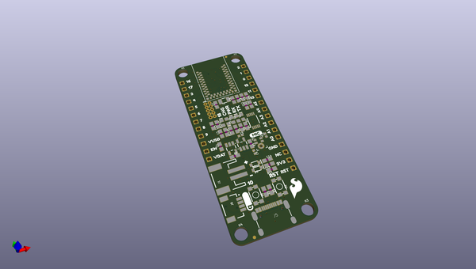

# OOMP Project  
## Artemis_Thing_Plus  by sparkfun  
  
oomp key: oomp_projects_flat_sparkfun_artemis_thing_plus  
(snippet of original readme)  
  
SparkFun Artemis Thing Plus  
========================================  
  
  
  
[*SparkFun Artemis Thing Plus (15574)*](https://www.sparkfun.com/products/15574)  
  
If you are looking for a board that (almost) does it all, look no further! The SparkFun Artemis Thing Plus takes our popular Thing Plus footprint and adds in the powerful Artemis module for ultimate functionality. Fully compatible with SparkFun's Arduino core, the modern USB-C connector makes it easy to program under the Arduino IDE but for more advanced users who prefer to use the power and speed of professional tools, we've also exposed the JTAG connector. To make the Thing Plus even easier to use, we've moved a few pins around to make the board Feather compatible and it utilizes our handy Qwiic Connect System which means no soldering or shields are required to connect it to the rest of your system!  
  
With 1MB flash and 384k RAM you'll have plenty of room for your sketches. The on-board Artemis module runs at 48MHz with a 96MHz turbo mode available and with Bluetooth to boot! We've added a digital MEMS microphone for folks wanting to experiment with always-on voice commands with TensorFlow and machine learning. The addition of the Qwiic connector opens up plug-and-play I2C functionality with our wide array of Qwiic boards.   
  
With so much functionality, the SparkFun Artemis Thing Plus is an ide  
  full source readme at [readme_src.md](readme_src.md)  
  
source repo at: [https://github.com/sparkfun/Artemis_Thing_Plus](https://github.com/sparkfun/Artemis_Thing_Plus)  
## Board  
  
  
## Schematic  
  
  
  
[schematic pdf](working_schematic.pdf)  
## Images  
