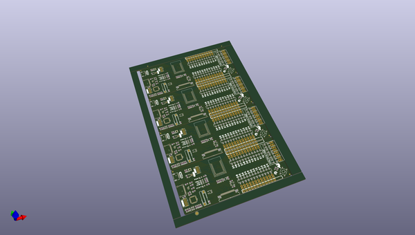
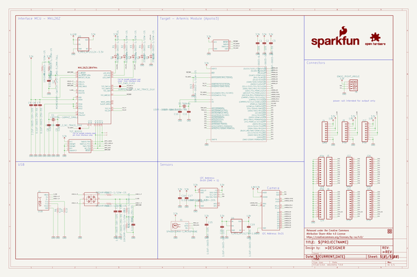

# OOMP Project  
## ArtemisDevKit  by sparkfun  
  
oomp key: oomp_projects_flat_sparkfun_artemisdevkit  
(snippet of original readme)  
  
SparkFun Artemis Development Kit  
========================================  
  
  
  
* [*SparkFun Artemis Development Kit (DEV-16828)*](https://www.sparkfun.com/products/16828)  
* [*SparkFun Artemis Development Kit with Camera (KIT-17071)*](https://www.sparkfun.com/products/17071)  
  
The [*SparkFun Artemis Development Kit (DEV-16828)*](https://www.sparkfun.com/products/16828) is the latest board to be released around the SparkFun Artemis Module and it allows access to more software development features than previous Artemis based boards. Recommended software used to program the Artemis DK are the Arduino IDE, Arm® Mbed™ OS (Studio and CLI), and AmbiqSDK. An updated USB interface (MKL26Z128VFM4 Arm® Cortex®-M0+ MCU, from NXP) allows the Artemis Dev Kit to act as:  
  
* Mass Storage Device (MSD): Used to provide drag and drop programming to the Artemis Module.  
* Human Interface Device (HID): Used for the debugging interface to the Artemis Module.  
* Communication Port (COM): Used to provide a serial communication UART between the Artemis and the USB connection (PC).  
  
  
Repository Contents  
-------------------  
  
* **/Hardware**  
   * Eagle design files (.brd, .sch)  
   * Dimensions (.pdf and .png)  
   * **/Production** - Production panel files (.brd)  
* **/Reference**  
   * Datasheets (.pdf)  
   * Functional Block Digaram (.png)  
  
D  
  full source readme at [readme_src.md](readme_src.md)  
  
source repo at: [https://github.com/sparkfun/ArtemisDevKit](https://github.com/sparkfun/ArtemisDevKit)  
## Board  
  
  
## Schematic  
  
  
  
[schematic pdf](working_schematic.pdf)  
## Images  
