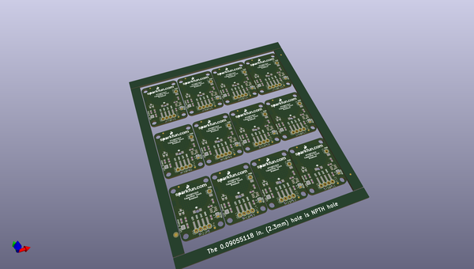
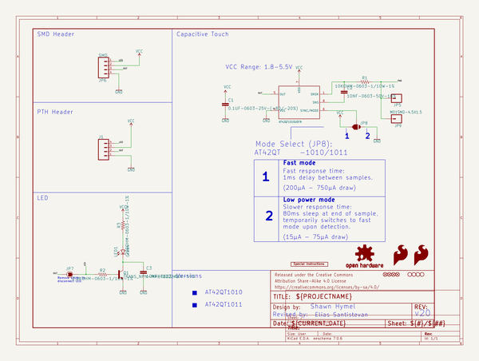

# OOMP Project  
## AT42QT1010_Capacitive_Touch_Breakout  by sparkfun  
  
oomp key: oomp_projects_flat_sparkfun_at42qt1010_capacitive_touch_breakout  
(snippet of original readme)  
  
SparkFun Capacitive Touch Breakout - AT42QT101X  
====================================  
  
<table class="table table-hover table-striped table-bordered">  
  <tr>  
   <td><a href="https://www.sparkfun.com/products/12041">

</a></td>  
  <td><a href="https://www.sparkfun.com/products/14520">

</a>
</td>  
  </tr>  
  <tr>  
    <td>
SparkFun Capacitive Touch Breakout - AT42QT1010 [<a href="https://www.sparkfun.com/products/12041">SEN-12041</a>]
</td>  
    <td>
SparkFun Capacitive Touch Breakout - AT42QT1011 [<a href="https://www.sparkfun.com/products/14520">SEN-14520</a>]
</td>  
  </tr>  
</table>  
  
If you need to add user input without using a button, then a capacitive touch interface might be the answer. The AT42QT1010 and AT42QT1011 Capacitive Touch Breakout boards offer a single capacitive touch button with easy-to-use digital I/O pins. Each model features a slightly different output duration.  
  
Repository Contents  
-------------------  
* **/Documentation** - Datasheet  
* **/Firmware** - Example Arduino sketches  
* **/Hardware** - All Eagle design fil  
  full source readme at [readme_src.md](readme_src.md)  
  
source repo at: [https://github.com/sparkfun/AT42QT1010_Capacitive_Touch_Breakout](https://github.com/sparkfun/AT42QT1010_Capacitive_Touch_Breakout)  
## Board  
  
  
## Schematic  
  
  
  
[schematic pdf](working_schematic.pdf)  
## Images  
