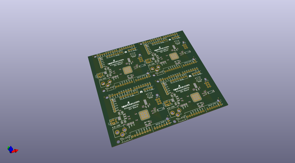
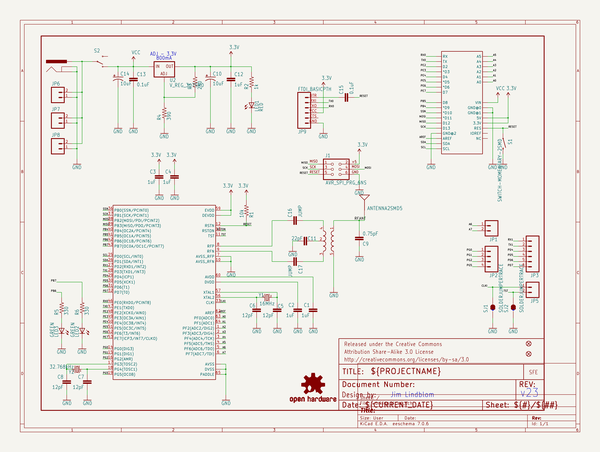
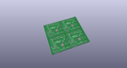
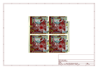
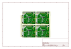
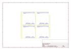
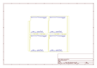
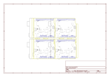

# OOMP Project  
## ATmega128RFA1_Dev  by sparkfun  
  
oomp key: oomp_projects_flat_sparkfun_atmega128rfa1_dev  
(snippet of original readme)  
  
ATmega128RFA1 Development Board  
======  
  
A development platform for the ATmega128RFA1 -- an 8-bit microcontroller combined with an 802.15.4 RF engine.  
  
[    
*ATmega128RFA1 Dev Board*](https://www.sparkfun.com/products/11197)  
  
Design files and firmware files for the [ATmega128RFA1 Development Board](https://www.sparkfun.com/products/11197).  
  
Repository Contents  
-------------------  
  
* **/hardware** - Eagle PCB layout files  
* **/firmware** - Arduino addon and example sketches to make use of it. (See [the hookup guide](https://learn.sparkfun.com/tutorials/atmega128rfa1-dev-board-hookup-guide) for help installing this.)  
* **/Production Files** - Files to support SparkFun production  
  
  
License Information  
-------------------  
  
All contents of this repository are released under [Creative Commons Share-alike 3.0](http://creativecommons.org/licenses/by-sa/3.0/).  
  
Authors: Jim Lindblom @ SparkFun Electonics  
  
  full source readme at [readme_src.md](readme_src.md)  
  
source repo at: [https://github.com/sparkfun/ATmega128RFA1_Dev](https://github.com/sparkfun/ATmega128RFA1_Dev)  
## Board  
  
  
## Schematic  
  
  
  
[schematic pdf](working_schematic.pdf)  
## Images  
  
  
  
  
  
  
  
  
  
  
  
  
  
  
  
  
