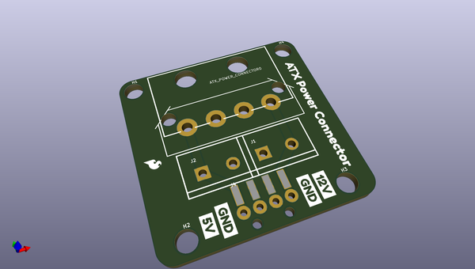
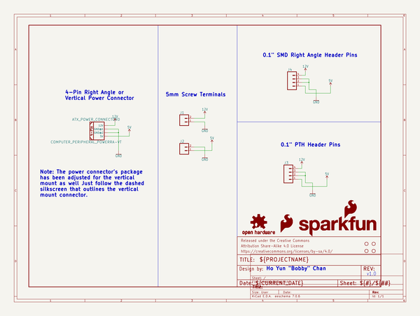

# OOMP Project  
## ATX_Power_Connector_Breakout  by sparkfun  
  
oomp key: oomp_projects_flat_sparkfun_atx_power_connector_breakout  
(snippet of original readme)  
  
SparkFun ATX Power Connector Breakout - 12V/5V (4-pin)  
========================================  
  
<table class="table table-hover table-striped table-bordered">  
  <tr align="center">  
   <td></td>  
   <td></td>  
  </tr>  
  <tr align="center">  
    <td><i>SparkFun ATX Power Connector Breakout - 12V/5V (4-pin) <a href="https://www.sparkfun.com/products/15035">(BOB-15035)</a></i></td>  
    <td><i>SparkFun ATX Power Connector Breakout Kit - 12V/5V (4-pin) <a href="https://www.sparkfun.com/products/15701">(KIT-15701)</a></i></td>  
  </tr>  
</table>  
  
Do you need to power a project with 12V and 5V from one power supply? The ATX power connector breakout board breaks out the standard 4-pin computer peripheral port when mated with an ATX connector [(PRT-15700)](https://www.sparkfun.com/products/15700) for your 12V and 5V devices! Once you have chosen a power supply (whether it be an ATX power supply or the 12V/5V wall adapter), you're ready to give your project some life! This kit has everything you need (including a 12V/5  
  full source readme at [readme_src.md](readme_src.md)  
  
source repo at: [https://github.com/sparkfun/ATX_Power_Connector_Breakout](https://github.com/sparkfun/ATX_Power_Connector_Breakout)  
## Board  
  
  
## Schematic  
  
  
  
[schematic pdf](working_schematic.pdf)  
## Images  
