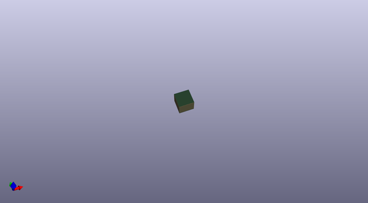

# OOMP Project  
## Audio_Amplifier_Kit-STA540  by sparkfun  
  
(snippet of original readme)  
  
SparkFun Audio Amplifier Kit - STA540  
======================================  
  
  
  
[*SparkFun Audio Amplifier Kit - STA540 (KIT-09612)*](https://www.sparkfun.com/products/9612)  
  
This is a stereo amplifier kit designed to make use of the STA540 power amplifier IC.   
Once this kit is completed you have a fully functional, two-channel audio amplifier, complete with a standby switch,   
volume control and indicator LEDs. The kit also includes a 6400BG heatsink for the STA540 to dissipate any damaging heat.  
  
Repository Contents  
-------------------  
* **/Hardware** - All Eagle design files (.brd, .sch)  
  
  
License Information  
-------------------  
The hardware is released under [Creative Commons ShareAlike 4.0 International](https://creativecommons.org/licenses/by-sa/4.0/).  
The code is beerware; if you see me (or any other SparkFun employee) at the local, and you've found our code helpful, please buy us a round!  
  
Distributed as-is; no warranty is given.  
  
  full source readme at [readme_src.md](readme_src.md)  
  
source repo at: [https://github.com/sparkfun/Audio_Amplifier_Kit-STA540](https://github.com/sparkfun/Audio_Amplifier_Kit-STA540)  
## Board  
  
  
## Schematic  
  
  
  
[schematic pdf](working_schematic.pdf)  
## Images  
