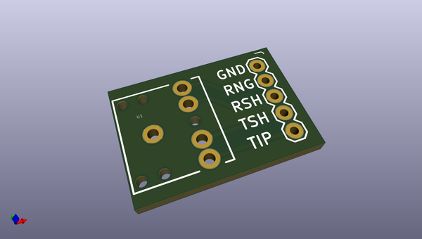
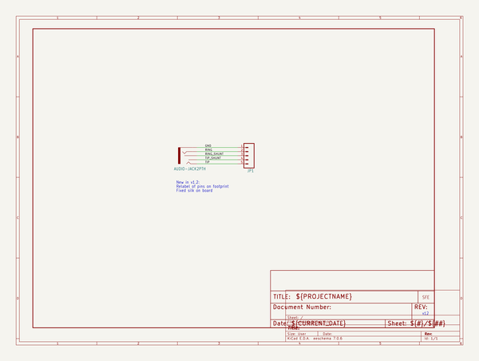
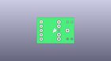
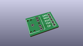
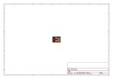
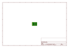
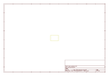
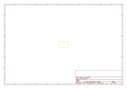
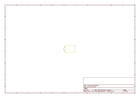

# OOMP Project  
## Audio_Jack_Breakout  by sparkfun  
  
oomp key: oomp_projects_flat_sparkfun_audio_jack_breakout  
(snippet of original readme)  
  
SparkFun Audio Jack Breakout  
========================================  
  
  
  
[*SparkFun Audio Jack Breakout (PRT-10588)*](https://www.sparkfun.com/products/10588)  
  
Simple breakout board for the 3.5mm audio jack.   
Use this breakout (shipped bare) to allow breadboard or SIP access to the super-common 3.5mm audio jack.   
All five pins are broken out.  
  
Repository Contents  
-------------------  
  
* **/Hardware** - Eagle design files (.brd, .sch)  
  
  
Documentation  
--------------  
* **[SparkFun Fritzing repo](https://github.com/sparkfun/Fritzing_Parts)** - Fritzing diagrams for SparkFun products.  
* **[SparkFun 3D Model repo](https://github.com/sparkfun/3D_Models)** - 3D models of SparkFun products.   
  
  
License Information  
-------------------  
This product is _**open source**_!   
  
The **hardware** is released under [Creative Commons ShareAlike 4.0 International](https://creativecommons.org/licenses/by-sa/4.0/).  
  
Please use, reuse, and modify these files as you see fit. Please maintain attribution to SparkFun Electronics and release anything derivative under the same license.  
  
Distributed as-is; no warranty is given.  
  
- Your friends at SparkFun.  
  
  
  
  full source readme at [readme_src.md](readme_src.md)  
  
source repo at: [https://github.com/sparkfun/Audio_Jack_Breakout](https://github.com/sparkfun/Audio_Jack_Breakout)  
## Board  
  
  
## Schematic  
  
  
  
[schematic pdf](working_schematic.pdf)  
## Images  
  
  
  
  
  
  
  
  
  
  
  
  
  
  
  
  
