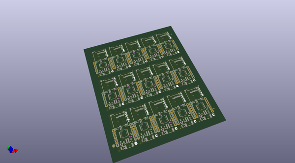
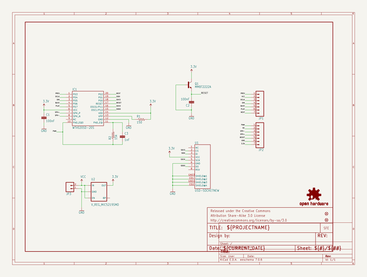
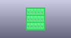
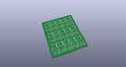
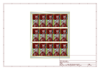
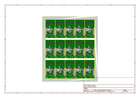
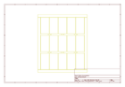
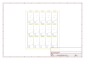

# OOMP Project  
## Audio-Sound_Breakout-WTV020SD  by sparkfun  
  
(snippet of original readme)  
  
**NOTE:** *This product has been retired from our catalog. For alternatives, try looking at the following products from the [Audio boards](https://www.sparkfun.com/categories/343):*  
  
* [Little Soundie Audio Player](https://www.sparkfun.com/products/14006)  
* [Qwiic MP3 Trigger](https://www.sparkfun.com/products/15165)  
  
*If you are looking for more up-to-date info, please check out some of these resources to see how other users are still hacking and improving on this product.*  
  
* *[SparkFun Forum](https://forum.sparkfun.com/)*  
* *[IRC Channel](https://www.sparkfun.com/news/263)*  
  
Audio-Sound Breakout  
====================  
  
[    
*Audio-Sound Breakout (WIG-11125)*](https://www.sparkfun.com/products/11125)  
  
* Firmware was compiled in Arduino 1.0.3.  
* Hardware was developed in EAGLE 6.3.0.  
* Fritzing part created under 0.7.12.  
  
  
  
License Information  
-------------------  
The hardware design is released under [CC-SA v3 license](http://creativecommons.org/licenses/by-sa/3.0/us/).  
  
The firmware is released under a modified beerware license, allowing for the purchase of any libation, alcoholic or non.  
  
  
  
  full source readme at [readme_src.md](readme_src.md)  
  
source repo at: [https://github.com/sparkfun/Audio-Sound_Breakout-WTV020SD](https://github.com/sparkfun/Audio-Sound_Breakout-WTV020SD)  
## Board  
  
  
## Schematic  
  
  
  
[schematic pdf](working_schematic.pdf)  
## Images  
  
  
  
  
  
  
  
  
  
  
  
  
  
  
  
  
