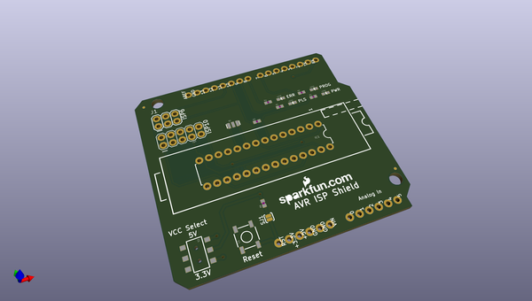
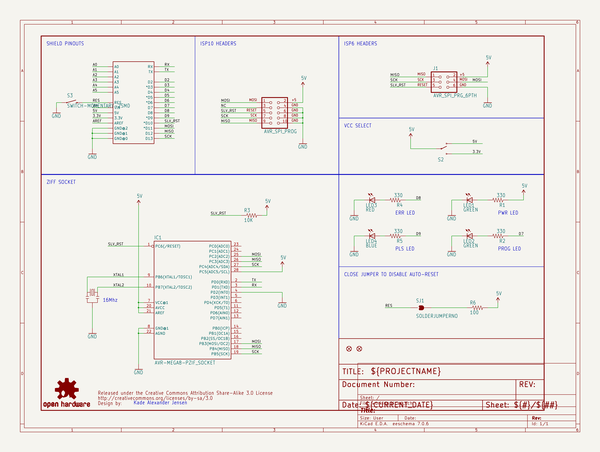
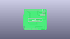
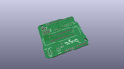
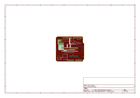
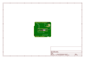
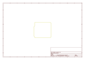
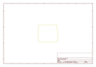
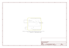

# OOMP Project  
## AVR_ISP_Shield  by sparkfun  
  
(snippet of original readme)  
  
SparkFun AVR ISP Shield  
========================  
  
  
  
[*SparkFun AVR ISP Shield (DEV-11168)*](https://www.sparkfun.com/products/11168)  
  
This shield, once assembled, gives your Arduino a 28-pin ZIF (Zero Insertion Force) socket so it can grab onto unsuspecting ICs.   
The socket is wired to work directly with the ArduinoISP code, but burning bootloaders isn’t the only thing you can do with it.   
We’ve also connected the serial I/Os so that if you’re a programming ninja you can do cool tricks like programming ICs using the bootloader on-the-go.  
  
Repository Contents  
-------------------  
* **/Hardware** - All Eagle design files (.brd, .sch)  
  
License Information  
-------------------  
The hardware is released under [Creative Commons ShareAlike 4.0 International](https://creativecommons.org/licenses/by-sa/4.0/).  
  
Distributed as-is; no warranty is given.  
  
  full source readme at [readme_src.md](readme_src.md)  
  
source repo at: [https://github.com/sparkfun/AVR_ISP_Shield](https://github.com/sparkfun/AVR_ISP_Shield)  
## Board  
  
  
## Schematic  
  
  
  
[schematic pdf](working_schematic.pdf)  
## Images  
  
  
  
  
  
  
  
  
  
  
  
  
  
  
  
  
