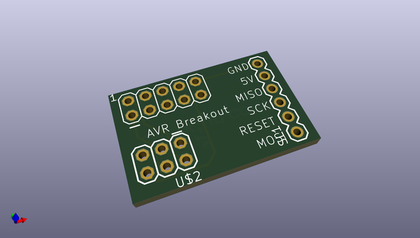
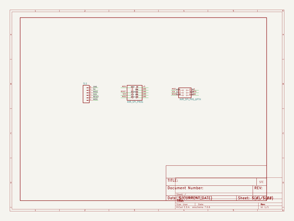
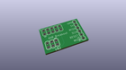
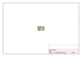
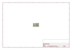
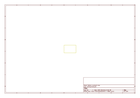
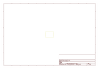
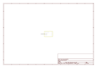

# OOMP Project  
## AVR_Programming_Adapter  by sparkfun  
  
(snippet of original readme)  
  
**NOTE:** *This product has been retired from our catalog. We recommmend using the [SparkFun ISP Pogo Adapter](https://www.sparkfun.com/products/11591) as an alternative. If you are looking for more up-to-date info, please check out thef ollowing resource to see how other users are still hacking and improving on this product.*  
  
* *[SparkFun Forum](https://forum.sparkfun.com/)*  
  
AVR Programming Adapter  
=======================  
  
[  
*SparkFun AVR Programming Adapter (BOB-08508)*](https://www.sparkfun.com/products/8508)  
  
This pcb adapts 10-pin ISP programmers to the smaller 6-pin ISP connections.   
It can also be inserted directly into a breadboard with the 0.1" headers.   
  
Repository Contents  
-------------------  
* **/Hardware** - All Eagle design files (.brd, .sch)  
  
  
License Information  
-------------------  
The hardware is released under [Creative Commons ShareAlike 4.0 International](https://creativecommons.org/licenses/by-sa/4.0/).  
  
Distributed as-is; no warranty is given.  
  
  full source readme at [readme_src.md](readme_src.md)  
  
source repo at: [https://github.com/sparkfun/AVR_Programming_Adapter](https://github.com/sparkfun/AVR_Programming_Adapter)  
## Board  
  
  
## Schematic  
  
  
  
[schematic pdf](working_schematic.pdf)  
## Images  
  
  
  
  
  
  
  
  
  
  
  
  
  
  
  
  
