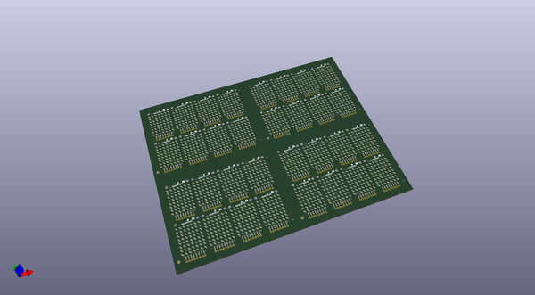
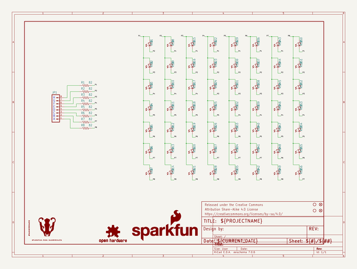

# OOMP Project  
## BadgerArray  by sparkfun  
  
(snippet of original readme)  
  
Interactive Badges -Charlieplexed 8x7 LED Array  
===============================================  
  
Charlieplexed 8x7 LED array to be used with the Interactive Badges for SXSW 2015.  
  
Please check out the [BadgerHack Tutorial](http://sfe.io/t349) for more information.   
The accompanying badges' information can be found [here](https://github.com/sparkfun/Interactive_Badges/tree/sxsw2015).  
The BadgerHack Demos are available [here](https://github.com/sparkfun/BadgerHack_Demos).  
  
 Repository Contents  
-------------------  
  
* **/Hardware** - All Eagle design files (.brd, .sch)  
* **/Libraries** - Example Arduino Library.  
* **/Production** - Test bed files and production panel files  
  
  
License Information  
-------------------  
  
The hardware is released under [Creative Commons ShareAlike 4.0 International](https://creativecommons.org/licenses/by-sa/4.0/).  
The code is beerware; if you see me (or any other SparkFun employee) at the local, and you've found our code helpful, please buy us a round!  
  
Distributed as-is; no warranty is given.  
  
  full source readme at [readme_src.md](readme_src.md)  
  
source repo at: [https://github.com/sparkfun/BadgerArray](https://github.com/sparkfun/BadgerArray)  
## Board  
  
  
## Schematic  
  
  
  
[schematic pdf](working_schematic.pdf)  
## Images  
