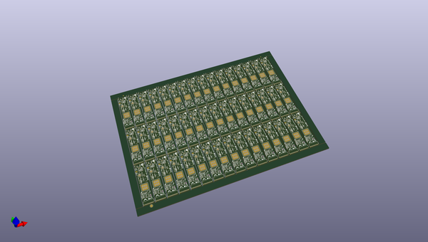
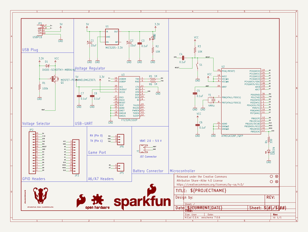
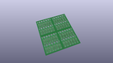
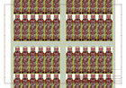
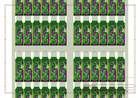
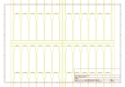
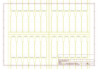
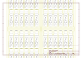

# OOMP Project  
## BadgerStick  by sparkfun  
  
(snippet of original readme)  
  
Interactive Badges  
==================  
   
   
   
 [*SparkFun BadgerHack *](https://learn.sparkfun.com/tutorials/badgerhack)  
   
 These badges were designed as a soldering demo for the SparkFun booths at Maker Faire.   
 They were designed to teach the basics of PTH soldering, as well as to provide users with an Arduino platform they could take home and hack.  
   
Please view the [BadgerHack tutorial](https://learn.sparkfun.com/tutorials/badgerhack) for more information on updating the firmware, and further experiments with your badge.   
   
 Repository Contents  
-------------------  
  
* **/badgerstick/avr** - Board definition files for Arduino.  
* **/Documentation** - SoftwareSerial Baud Rate table  
* **/Firmware** - Default firmware that ships on the BadgerStick  
* **/Hardware** - All Eagle design files (.brd, .sch)  
* **/Production** - Test bed files and production panel files  
  
Documentation  
--------------  
* **[Library](https://github.com/sparkfun/SparkFun_LED_Array_8x7_Arduino_Library)** - Arduino library for the BadgerStick.  
* **[Hookup Guide](https://learn.sparkfun.com/tutorials/badgerhack)** - Basic hookup guide for the BadgerStick.   
* **[SparkFun Fritzing repo](https://github.com/sparkfun/Fritzing_Parts)** - Fritzing diagrams for SparkFun products.  
* **[SparkFun 3D Model repo](https://github.com/sparkfun/3D_Models)** - 3D models of SparkFun products.   
* **[SparkFun Graphical  
  full source readme at [readme_src.md](readme_src.md)  
  
source repo at: [https://github.com/sparkfun/BadgerStick](https://github.com/sparkfun/BadgerStick)  
## Board  
  
  
## Schematic  
  
  
  
[schematic pdf](working_schematic.pdf)  
## Images  
  
  
  
  
  
  
  
  
  
  
  
  
  
  
  
  
