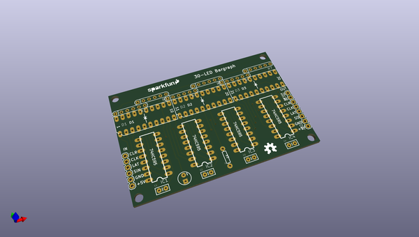
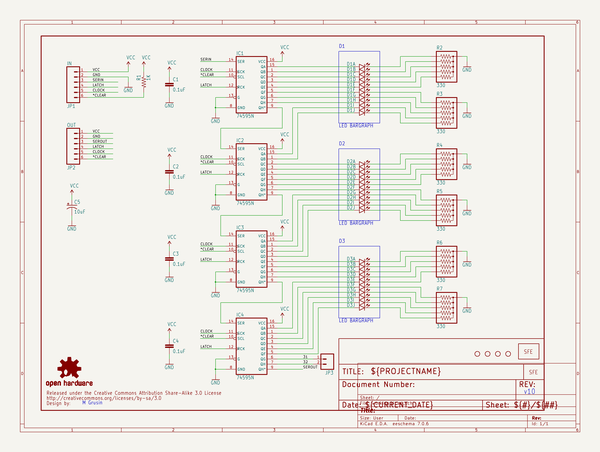
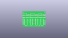
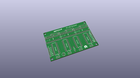
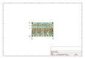
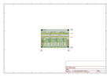
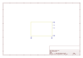
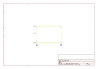
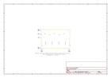

# OOMP Project  
## Bar_Graph_Breakout_Kit  by sparkfun  
  
oomp key: oomp_projects_flat_sparkfun_bar_graph_breakout_kit  
(snippet of original readme)  
  
SparkFun Bar Graph Breakout Kit  
========================================  
  
  
  
[*SparkFun Bar Graph Breakout Kit (DEV-10936)*](https://www.sparkfun.com/products/10936)  
  
This kit contains a PCB and all the parts needed to build a 30-LED bargraph that can be driven by an Arduino or other microcontroller.  
  
This kit uses our 74HC595 shift registers and 10-Segment bargraph modules to create the display. We supply one green, one yellow, and one red module for ‘safe / caution / DANGER!’ displays.   
The display is easily driven by a microcontroller using an SSI interface, and you have individual control over every LED.  
  
Repository Contents  
-------------------  
  
* **/Hardware** - Eagle design files (.brd, .sch)  
* **/Libraries** - Libraries for use with the <PRODUCT NAME>  
* **/Production** - Production panel files (.brd)  
  
Documentation  
--------------  
* **[Library](https://github.com/sparkfun/SparkFun_Bar_Graph_Breakout_Arduino_Library)** - Arduino library for the Bar Graph Breakout KIt.  
* **[Hookup Guide](http://cdn.sparkfun.com/datasheets/Kits/Bargraph%20Breakout%20Kit%20111227.pdf)** - Basic hookup guide for the Bar Graph Kit.  
* **[SparkFun Fritzing repo](https://github.com/sparkfun/Fritzing_Parts)** - Fritzing diagrams for SparkFun products.  
* **[SparkFun 3D Model repo](https://github.com/sparkfun/3D_Models)** - 3D models of SparkFun products.   
  
License Information  
-------------------  
This prod  
  full source readme at [readme_src.md](readme_src.md)  
  
source repo at: [https://github.com/sparkfun/Bar_Graph_Breakout_Kit](https://github.com/sparkfun/Bar_Graph_Breakout_Kit)  
## Board  
  
  
## Schematic  
  
  
  
[schematic pdf](working_schematic.pdf)  
## Images  
  
  
  
  
  
  
  
  
  
  
  
  
  
  
  
  
