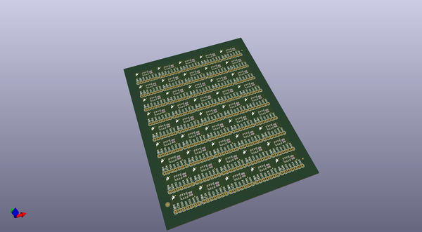
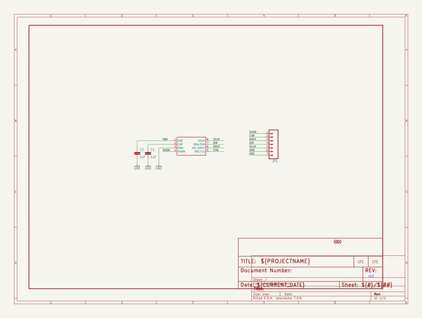

# OOMP Project  
## Barometric_Pressure_Sensor_Breakout-MPL115A1  by sparkfun  
  
(snippet of original readme)  
  
SparkFun Barometric Pressure Sensor Breakout - MPL115A1  
========================================  
  
  
  
[*SparkFun Barometric Pressure Sensor Breakout - MPL115A1 (SEN-09721)*](https://www.sparkfun.com/products/9721)  
  
Now mounted on a breakout board, the MPL115A1 is a digital barometer that uses MEMs technology to give accurate pressure measurements between 50kPa and 115kPa.  
We stock the SPI interface version of the sensor.   
Average current consumption is 10µA at one measurement per second.  
  
Repository Contents  
-------------------  
  
* **/Firmware** - Example code   
* **/Hardware** - Eagle design files (.brd, .sch)  
* **/Libraries** - Libraries for use with the <PRODUCT NAME>  
* **/Production** - Production panel files (.brd)  
  
Documentation  
--------------  
* **[SparkFun Fritzing repo](https://github.com/sparkfun/Fritzing_Parts)** - Fritzing diagrams for SparkFun products.  
* **[SparkFun 3D Model repo](https://github.com/sparkfun/3D_Models)** - 3D models of SparkFun products.   
  
  
License Information  
-------------------  
This product is _**open source**_!   
  
The **hardware** is released under [Creative Commons ShareAlike 4.0 International](https://creativecommons.org/licenses/by-sa/4.0/).  
  
The **code** is beerware; if you see me (or any other SparkFun employee) at the local, and you've found our code helpful, please buy us a round!  
  
Please use, reuse, and modify these files a  
  full source readme at [readme_src.md](readme_src.md)  
  
source repo at: [https://github.com/sparkfun/Barometric_Pressure_Sensor_Breakout-MPL115A1](https://github.com/sparkfun/Barometric_Pressure_Sensor_Breakout-MPL115A1)  
## Board  
  
  
## Schematic  
  
  
  
[schematic pdf](working_schematic.pdf)  
## Images  
