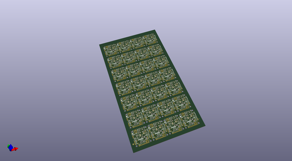
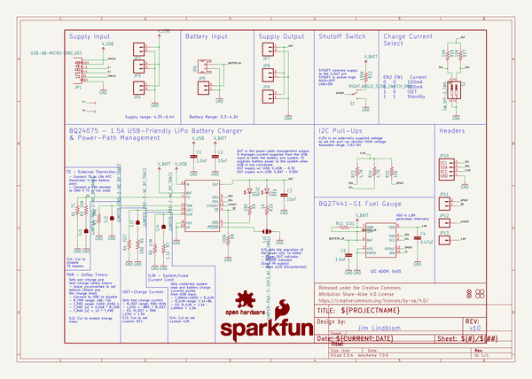
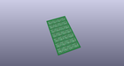
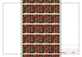
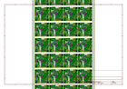
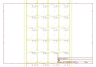
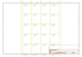
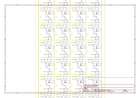

# OOMP Project  
## Battery_Babysitter  by sparkfun  
  
oomp key: oomp_projects_flat_sparkfun_battery_babysitter  
(snippet of original readme)  
  
SparkFun Battery Babysitter  
========================================  
  
  
  
[*SparkFun Battery Babysitter (PRT-13777)*](https://www.sparkfun.com/products/13777)  
  
The [SparkFun Battery Babysitter](https://www.sparkfun.com/products/13777) is an all-in-one single-cell lithium polymer (LiPo) battery manager. It’s half **battery-charger**, half **battery monitor**, and it’s all you’ll ever need to keep your battery-powered project running safely and extensively.  
  
The Battery Babysitter features a pair of Texas Instruments LiPo-management IC’s: a [BQ24075 battery charger](http://www.ti.com/product/BQ24075) and a [BQ27441-G1A fuel gauge](http://www.ti.com/product/BQ27441-G1). The BQ24075 supports adjustable charge rates up to 1.5A, as well as USB-compliant 100mA and 500mA options. It also features power-path management, guaranteeing reliable power to your project.  
  
The self-calibrating, I2C-based BQ27441-G1A measures your battery’s voltage to estimate its charge percentage and remaining capacity. The chip is also hooked up to a current-sensing resistor, which allows it to measure current and power! It’s a handy IC to have, especially if you ever need to keep an extra eye on your project’s power draw.  
  
Repository Contents  
-------------------  
  
* **/Documentation** - Data sheets, additional product information  
* **/Hardware** - Eagle design files (.brd, .sc  
  full source readme at [readme_src.md](readme_src.md)  
  
source repo at: [https://github.com/sparkfun/Battery_Babysitter](https://github.com/sparkfun/Battery_Babysitter)  
## Board  
  
  
## Schematic  
  
  
  
[schematic pdf](working_schematic.pdf)  
## Images  
  
  
  
  
  
  
  
  
  
  
  
  
  
  
  
  
