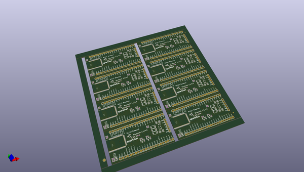
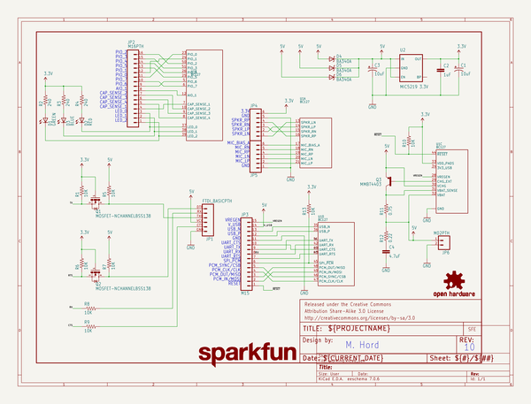
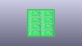
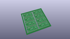
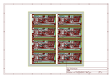
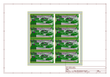
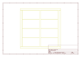
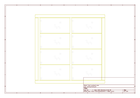
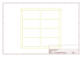
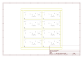

# OOMP Project  
## BC127_Breakout_Board  by sparkfun  
  
(snippet of original readme)  
  
BC127 Breakout Board  
==================  
  
General purpose breakout board for the BC127 module by BlueCreation.  
  
[    
*BC127 Breakout Board*](https://www.sparkfun.com/products/11927)  
  
Design files and firmware files for the [BC127 Breakout Board](https://www.sparkfun.com/products/11927).  
  
Repository Contents  
-------------------  
  
* **/hardware** - Eagle PCB layout files  
* **/Production Files** - Files to support SparkFun production  
* **/Fritzing** - Fritzing part for the BC127 Breakout Board  
* **/Libraries** - library and examples for the BC127 modules  
  
Documentation  
--------------  
* **[SparkFun 3D Model repo](https://github.com/sparkfun/3D_Models)** - 3D models of SparkFun products.  
  
License Information  
-------------------  
  
All contents of this repository are released under [Creative Commons Share-alike 4.0](http://creativecommons.org/licenses/by-sa/4.0/).  
  
Authors: Mike Hord @ SparkFun Electonics  
  
  full source readme at [readme_src.md](readme_src.md)  
  
source repo at: [https://github.com/sparkfun/BC127_Breakout_Board](https://github.com/sparkfun/BC127_Breakout_Board)  
## Board  
  
  
## Schematic  
  
  
  
[schematic pdf](working_schematic.pdf)  
## Images  
  
  
  
  
  
  
  
  
  
  
  
  
  
  
  
  
