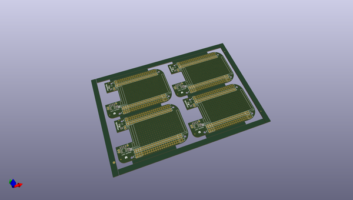
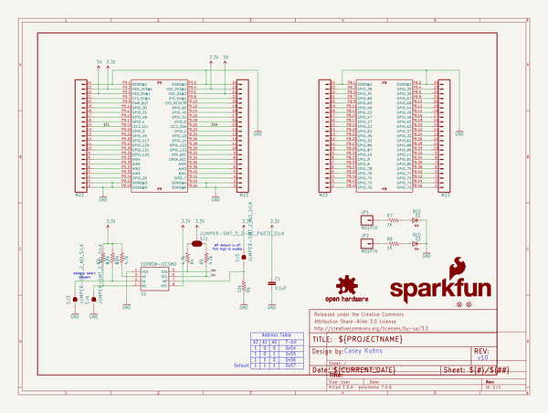
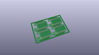
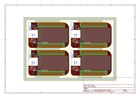
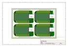
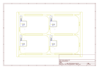
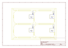
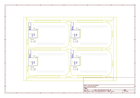

# OOMP Project  
## BeagleBone_Black_Proto_Cape  by sparkfun  
  
(snippet of original readme)  
  
BeagleBone Black Proto Cape  
===========================  
  
[  
*BeagleBone Black Proto Cape (DEV-12774)*](https://www.sparkfun.com/products/12774)  
   
 A prototyping cape designed for the BeagleBone Black. It has blank EEPROM for pin configuration data and  
 two red LEDs for debugging.   
  
Repository Contents  
-------------------  
* **/Hardware** - All Eagle design files (.brd, .sch, .STL)  
* **/Production** - Test bed files and production panel files  
  
Version History  
---------------  
* [V_1.0.0](https://github.com/sparkfun/BeagleBone_Black_Proto_Cape/tree/V_1.0.0) - Public release  
* [V_1.0.1](https://github.com/sparkfun/BeagleBone_Black_Proto_Cape/tree/V_1.0.1) - Updated jumper packages to DFM standard (Increased aperture).  
  
License Information  
-------------------  
The hardware is released under [Creative Commons ShareAlike 4.0 International](https://creativecommons.org/licenses/by-sa/4.0/).  
The code is beerware; if you see me (or any other SparkFun employee) at the local, and you've found our code helpful, please buy us a round!  
  
Distributed as-is; no warranty is given.  
  
  full source readme at [readme_src.md](readme_src.md)  
  
source repo at: [https://github.com/sparkfun/BeagleBone_Black_Proto_Cape](https://github.com/sparkfun/BeagleBone_Black_Proto_Cape)  
## Board  
  
  
## Schematic  
  
  
  
[schematic pdf](working_schematic.pdf)  
## Images  
  
  
  
  
  
  
  
  
  
  
  
  
  
  
  
  
