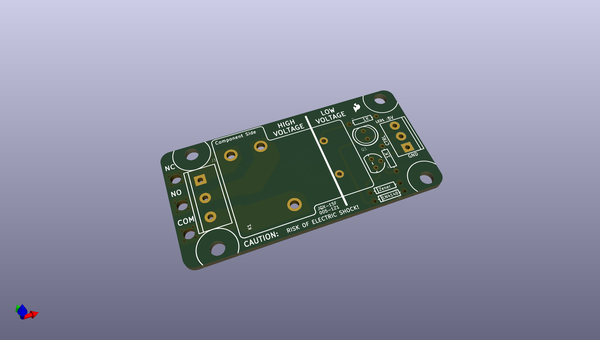
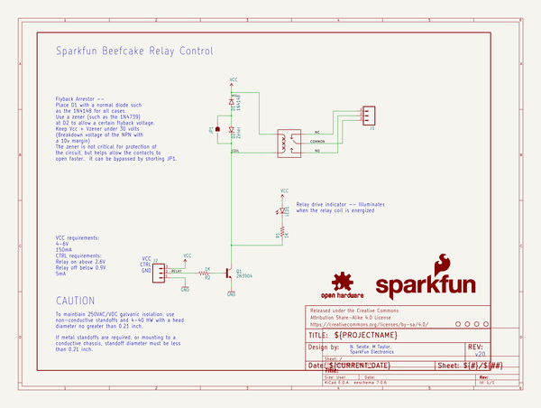

# OOMP Project  
## Beefcake_Relay_Control_Kit  by sparkfun  
  
(snippet of original readme)  
  
Beefcake Relay Control Kit  
==========================  
  
[    
*Beefcake Relay Control Kit (KIT-13815)*](https://www.sparkfun.com/products/13815)  
  
The Beefcake Relay Control Kit contains all the parts you need to get your high-power load under control.  
  
Repository Contents  
-------------------  
  
* **/Hardware** - Eagle design files (Schematic and Board)  
  
Documentation  
--------------  
* **[Hookup Guide](https://learn.sparkfun.com/tutorials/beefcake-relay-control-hookup-guide)** - Basic hookup guide for the Beefcake Relay Control Kit.  
* **[SparkFun Fritzing repo](https://github.com/sparkfun/Fritzing_Parts)** - Fritzing diagrams for SparkFun products.  
  
  
Product Versions  
----------------  
* [KIT-13815](https://www.sparkfun.com/products/13815) - Beefcake Relay Control Kit  
  
Version History  
---------------  
* [v1.6](https://github.com/sparkfun/Beefcake_Relay_Control_Kit/tree/v1.6) - SPST version  
* [v2.0](https://github.com/sparkfun/Beefcake_Relay_Control_Kit/tree/v2.0) - SPDT version  
  
License Information  
-------------------  
  
This product is _**open source**_!   
  
Please review the LICENSE.md file for license information.   
  
If you have any questions or concerns on licensing, please contact techsupport@sparkfun.com.  
  
Distributed as-is; no warranty is given.  
  
- Your friends at SparkFun.  
  
  full source readme at [readme_src.md](readme_src.md)  
  
source repo at: [https://github.com/sparkfun/Beefcake_Relay_Control_Kit](https://github.com/sparkfun/Beefcake_Relay_Control_Kit)  
## Board  
  
  
## Schematic  
  
  
  
[schematic pdf](working_schematic.pdf)  
## Images  
