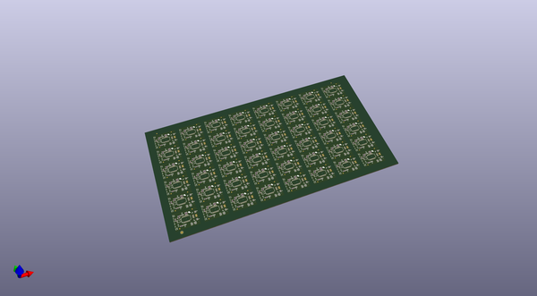
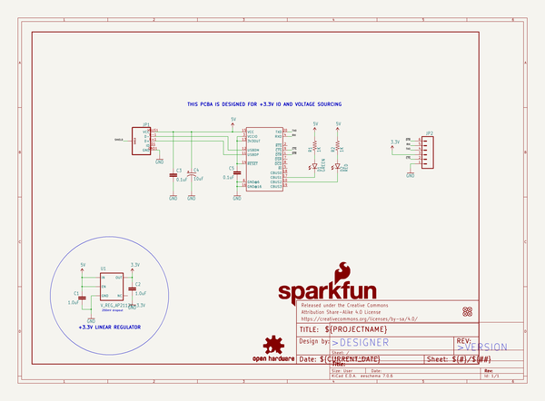
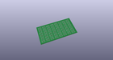
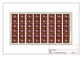
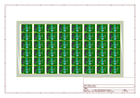
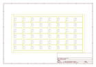
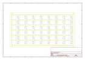
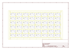

# OOMP Project  
## Beefy_3  by sparkfun  
  
oomp key: oomp_projects_flat_sparkfun_beefy_3  
(snippet of original readme)  
  
SparkFun FTDI Basic Breakout Board-3.3V  
========================================  
  
  
  
[*SparkFun Beefy 3 (3.3V FTDI Breakout) (DEV-13746)*](https://www.sparkfun.com/products/13746)  
  
This is a breakout board for the FTDI FT232RL USB to serial IC with integrated 3.3V (up to 600mA) regulator to power your project.  
The pinout of this board matches the FTDI cable to work with official Arduino and cloned 3.3V Arduino boards.  
  
Repository Contents  
-------------------  
* **/Hardware** &mdash; All Eagle design files (.brd, .sch)  
* **/Production** &mdash; Test bed files and production panel files  
  
Product Versions  
----------------  
*   
[This](https://www.sparkfun.com/products/13746) &mdash; Higher power 3.3V FTDI Breakout.  
* [DEV-09873](https://www.sparkfun.com/products/9873) &mdash; 3.3V FTDI Basic Breakout.  
* [DEV-09716](https://www.sparkfun.com/products/9716) &mdash; 5V FTDI Basic Breakout  
  
License Information  
-------------------  
The hardware is released under [Creative Commons ShareAlike 4.0 International](https://creativecommons.org/licenses/by-sa/4.0/).  
  
Distributed as-is; no warranty is given.  
  
  full source readme at [readme_src.md](readme_src.md)  
  
source repo at: [https://github.com/sparkfun/Beefy_3](https://github.com/sparkfun/Beefy_3)  
## Board  
  
  
## Schematic  
  
  
  
[schematic pdf](working_schematic.pdf)  
## Images  
  
  
  
  
  
  
  
  
  
  
  
  
  
  
  
  
