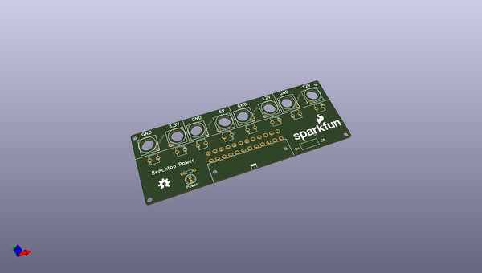
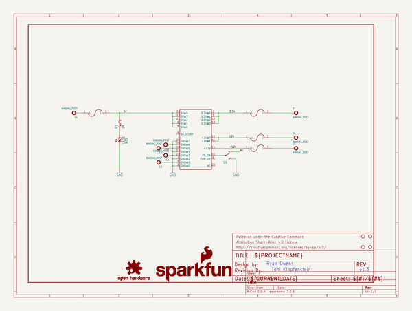
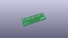
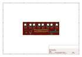
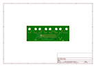
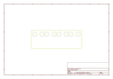
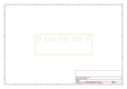
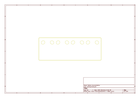
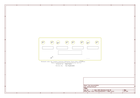

# OOMP Project  
## Benchtop_Power_Board_Kit  by sparkfun  
  
oomp key: oomp_projects_flat_sparkfun_benchtop_power_board_kit  
(snippet of original readme)  
  
Benchtop Power Board Kit  
========================  
  
  
  
[*Benchtop Power Board Kit (KIT-09774)*](https://www.sparkfun.com/products/9774)  
  
The benchtop power board kit was created to provide quick access to the typical voltages needed when   
developing physical computing projects. The kit provides access to 3.3V, 5V, 12V and -12V. After assembling the kit you'll have access to four different voltages (3.3V, 5V, 12V and -12V) each with their own replaceable 5A fuse  
  
  
Repository Contents  
-------------------  
* **/Hardware** - All Eagle design files (.brd, .sch)  
  
Documentation  
-------------------  
* **[Hookup Guide](https://learn.sparkfun.com/tutorials/benchtop-power-board-kit-hookup-guide)**  
  
License Information  
-------------------  
The hardware is released under [Creative Commons ShareAlike 4.0 International](https://creativecommons.org/licenses/by-sa/4.0/).  
  
Distributed as-is; no warranty is given.  
  
  full source readme at [readme_src.md](readme_src.md)  
  
source repo at: [https://github.com/sparkfun/Benchtop_Power_Board_Kit](https://github.com/sparkfun/Benchtop_Power_Board_Kit)  
## Board  
  
  
## Schematic  
  
  
  
[schematic pdf](working_schematic.pdf)  
## Images  
  
  
  
  
  
  
  
  
  
  
  
  
  
  
  
  
