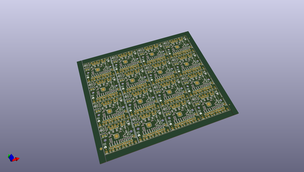
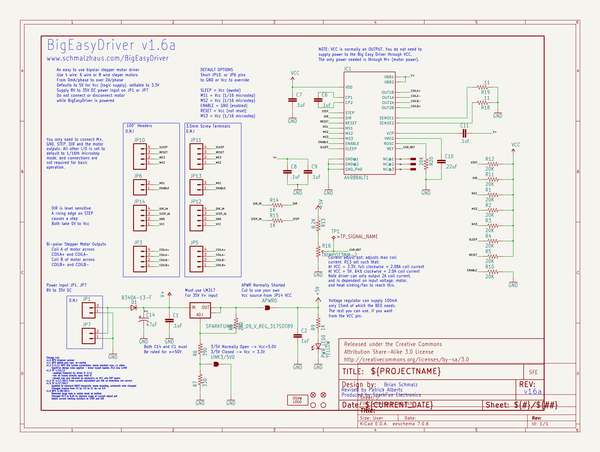
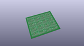
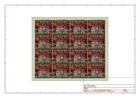
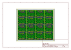
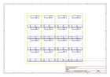
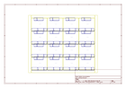
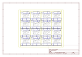

# OOMP Project  
## Big_Easy_Driver  by sparkfun  
  
oomp key: oomp_projects_flat_sparkfun_big_easy_driver  
(snippet of original readme)  
  
SparkFun Big Easy Driver  
========================  
  
  
  
[*SparkFun Big Easy Driver (ROB-12859)*](https://www.sparkfun.com/products/12859)  
  
This is a stepper motor driver board capable of driving bi-polar stepper motors at up to 2A/phase.  
  
Repository Contents  
-------------------  
  
* **/Firmware** - Example Arduino sketches   
* **/Hardware** - All Eagle design files (.brd, .sch)  
* **/Production** - Test bed files and production panel files  
  
Product Versions  
----------------  
* [ROB-12859](https://www.sparkfun.com/products/12859)- Version 1.6. Currently available.   
* [ROB-11876](https://www.sparkfun.com/products/retired/11876)- Version 1.5. Retired.   
* [ROB-11699](https://www.sparkfun.com/products/retired/11699)- Version 1.3. Retired.   
* [ROB-10735](https://www.sparkfun.com/products/retired/10735)- Version 1.2. Retired.  
  
Version History  
---------------  
* [Hw-v1.6_Fw-v1.0](https://github.com/sparkfun/Big_Easy_Driver/tree/HW-v1.6_Fw-v1.0) -GitHub tag for hardware version 1.6, firmware version 1.0.    
* [HW-v1.5](https://github.com/sparkfun/Big_Easy_Driver/tree/HW-v1.5) - GitHub tag for Hardware version 1.5.   
  
License Information  
-------------------  
The hardware is released under [Creative Commons Share-alike 3.0](http://creativecommons.org/licenses/by-sa/3.0/).    
  
The code is beerware; if you see me (or any other SparkFun employee) at the local, and you've found our code helpful, please buy us a round  
  full source readme at [readme_src.md](readme_src.md)  
  
source repo at: [https://github.com/sparkfun/Big_Easy_Driver](https://github.com/sparkfun/Big_Easy_Driver)  
## Board  
  
  
## Schematic  
  
  
  
[schematic pdf](working_schematic.pdf)  
## Images  
  
  
  
  
  
  
  
  
  
  
  
  
  
  
  
  
