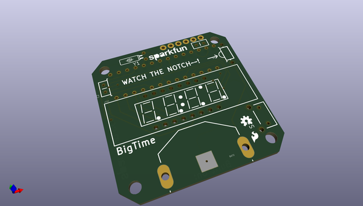
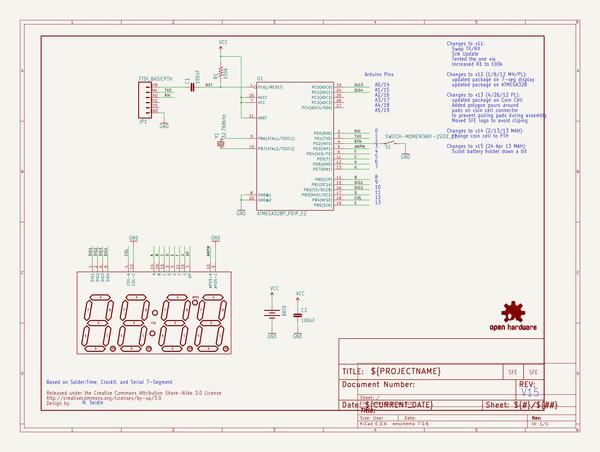
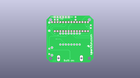
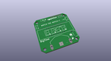
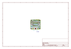
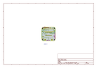
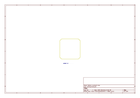
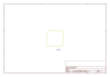
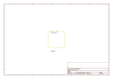
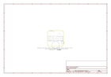

# OOMP Project  
## BigTime  by sparkfun  
  
(snippet of original readme)  
  
BigTime Watch Kit  
=================  
  
[_medium.jpg)    
*BigTime Watch Kit (KIT-11178)*](https://www.sparkfun.com/products/11178)  
  
BigTime is an open source hardware kit that allows the user to build their own watch.  
  
Repository Contents  
-------------------  
* **/Enclosure** - 3D files for watch enclosure  
* **/Firmware** - Firmware that ships on the BigTime watch and any example sketches available  
* **/Hardware** - All Eagle design files (.brd, .sch)  
  
Product Versions  
----------------  
* [KIT-11178](https://www.sparkfun.com/products/11178) - BigTime Watch Kit  
* [KIT-11210](https://www.sparkfun.com/products/11210) - Learn to Solder BigTime Watch Kit  
* [KIT-11653](https://www.sparkfun.com/products/11653) - Learn to Solder BigTime (EU edition, 230VAC)  
* [RTL-11054](https://www.sparkfun.com/products/11054) - Retail package of BigTime Watch Kit  
  
Version History  
---------------  
* **v1.0** Initial code release 7-17-2011  
* **v1.1** Added rough support for other display colors 8-19-2011  
  
License Information  
-------------------  
The hardware design is released under [CC-SA v3 license](http://creativecommons.org/licenses/by-sa/3.0/us/).    
  
The firmware is released under a modified [Beerware license](http://en.wikipedia.org/wiki/Beerware):    
> This project is forked with permission from Spikenzie labs' Solder:Time kit that is not open source. We really wanted to make the watch kits eas  
  full source readme at [readme_src.md](readme_src.md)  
  
source repo at: [https://github.com/sparkfun/BigTime](https://github.com/sparkfun/BigTime)  
## Board  
  
  
## Schematic  
  
  
  
[schematic pdf](working_schematic.pdf)  
## Images  
  
  
  
  
  
  
  
  
  
  
  
  
  
  
  
  
